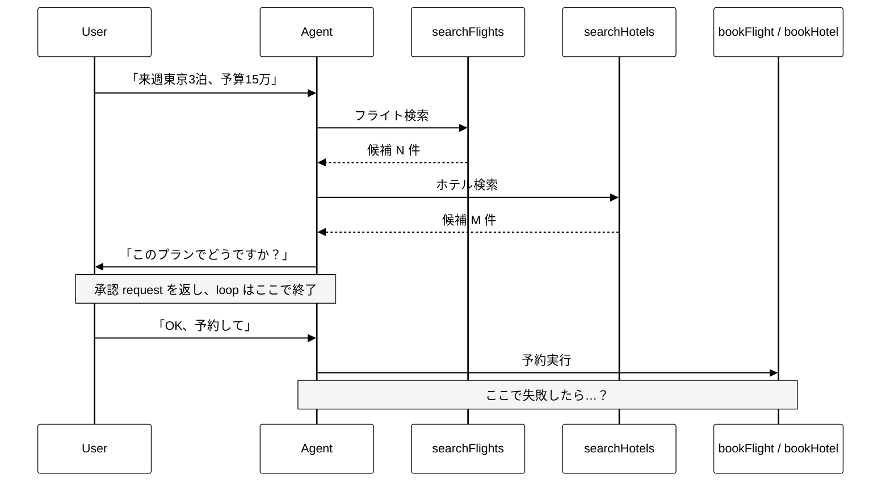
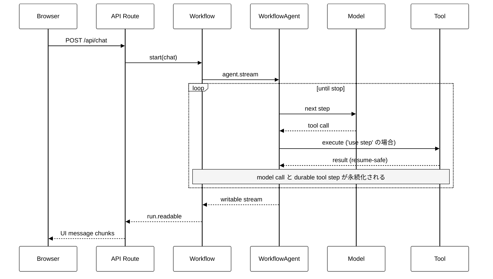

<div class="flex flex-col h-full justify-between">

<div>
  <div class="mm-folio">Vercel · AI SDK 7 stable · July 2026</div>
  <div class="mm-rule-thin mt-2"></div>
</div>

<div class="flex-1 flex flex-col justify-center">
  <div class="mm-display text-[6rem] leading-[1] italic">AI&nbsp;SDK</div>
  <div class="mm-display text-[10rem] leading-[1] italic -mt-2">v7</div>
  <div class="mm-rule-ultra mt-8 w-40"></div>
  <div class="mm-italic text-2xl mt-6 max-w-[36rem]">
    WorkflowAgent を中心に — 2026 年7月版
  </div>
</div>

<div class="flex items-end">
  <div class="mm-meta">
    2026 · 07 · TSUBOI HIROKI
  </div>
</div>

</div>

<!--
AI SDK 7 は 2026-06-25 に stable release。
2026-07-11 確認時点で npm latest は ai@7.0.22、@ai-sdk/workflow@1.0.22。
-->

---
layout: default
---

<div class="mm-folio mb-2">Contents · 目次</div>

# Table of Contents

<div class="grid grid-cols-3 gap-x-10 gap-y-5 mt-5">

<div class="border-t-2 border-black pt-3">
  <div class="mm-folio mb-1">00 · Aside</div>
  <div class="mm-italic text-xl">Versioning</div>
  <div class="text-sm opacity-70">Minor が常に 0 な理由</div>
</div>

<div class="border-t-2 border-black pt-3">
  <div class="mm-folio mb-1">01 · Chapter</div>
  <div class="mm-italic text-xl">Durability</div>
  <div class="text-sm opacity-70">なぜ Durable Agent か</div>
</div>

<div class="border-t-2 border-black pt-3">
  <div class="mm-folio mb-1">02 · Chapter</div>
  <div class="mm-italic text-xl">WorkflowAgent</div>
  <div class="text-sm opacity-70">基本実装と接続方法</div>
</div>

<div class="border-t-2 border-black pt-3">
  <div class="mm-folio mb-1">03 · Interlude</div>
  <div class="mm-italic text-xl">Directives</div>
  <div class="text-sm opacity-70">'use workflow' の系譜</div>
</div>

<div class="border-t-2 border-black pt-3">
  <div class="mm-folio mb-1">04 · Chapter</div>
  <div class="mm-italic text-xl">Catalog</div>
  <div class="text-sm opacity-70">v7 の他の新機能</div>
</div>

<div class="border-t-2 border-black pt-3">
  <div class="mm-folio mb-1">— · Endmatter</div>
  <div class="mm-italic text-xl">Summary</div>
  <div class="text-sm opacity-70">結語と参考文献</div>
</div>

</div>

---
layout: section
---

<div class="mm-folio opacity-70 mb-4">Aside</div>

# 00 — Versioning

---
layout: default
---

# 公式 Versioning Policy が答え

[ai-sdk.dev/v7/docs/migration-guides/versioning](https://ai-sdk.dev/v7/docs/migration-guides/versioning) に明文化されている

| 種類 | 公式ドキュメントの定義 |
|---|---|
| **Major** | Breaking API updates that require code changes |
| **Minor** | **Blog post that aggregates new features and improvements into a public release** |
| **Patch** | New features and bug fixes |

<v-click>

つまり SemVer の一般的な解釈とは違って:

- **新機能・改善は全部 Patch** に流し込む
- Minor は **「ブログを書く価値がある節目」** のときだけ上げる
- 結果として `5.0.x → 6.0.0` のように **Minor は 0 のまま**

</v-click>

<v-click>

「**新機能がない**」のではなく、Vercel が **Changesets で日次レベルにリリース**しているだけ
（2026-07-11 確認時点で `ai@7.0.22`、`@ai-sdk/workflow@1.0.22`）

</v-click>

---
layout: section
---

<div class="mm-folio opacity-70 mb-4">Chapter</div>

# 01 — Durability

---
layout: default
---

# ToolLoopAgent は保存済み履歴から「新しい実行」を始める

`DB に履歴が残る` = 落ちた loop の resume ではない。履歴を context に、**別の Agent 実行を起動する**

<v-clicks>

- DB から保存済みの `messages` / tool result を読み出す
- それを入力に `generate()` / `stream()` を再度呼び、**新しい loop を開始**
- 未保存の step・tool result・生成途中の回答などの **in-flight state は失う**
- したがって、同じ checkpoint からの **自動再開ではない**
- tool の副作用だけ成功して記録前に落ちると、再実行による二重処理を防ぐ **冪等性** が必要
- step 単位の永続化・再試行・観測はアプリ側で設計する

</v-clicks>

<!--
ここで「プロセスが落ちると進捗がすべて消える」とは言わない。
DB に保存済みのチャット履歴や tool result は残り、次の呼び出しの context に再利用できる。

ただし、それは保存された履歴を使った「新しい agent 実行」であり、
落ちた ToolLoopAgent の内部 loop を同じ位置から resume することではない。
たとえば航空券検索が終わった後、その結果を保存する前に落ちれば検索はやり直しになる。

さらに予約 API が成功した直後、成功結果の保存前に落ちると、
外部では予約済みなのに DB では未完了に見える。再実行には idempotency key や照合処理が必要。

messages、tool call、tool result、approval、step status を都度保存し、
job queue と冪等性も実装しているなら、アプリ側ですでに durability の一部を構築している。
WorkflowAgent の差は、この step checkpoint / replay / retry を runtime の責務として提供する点。

AI Workspace の実装は経路ごとに異なる。
通常の ToolLoopAgent route は、過去履歴とユーザー発話を DynamoDB から復元し、
assistant 応答は基本的に onEnd で保存する。onStepEnd は telemetry / UI 更新が中心で、
tool call / tool result を durable step として保存してはいない。
コード上も timeout 時は onEnd が bypass され、部分応答は保存されないと明記されている。

一方、General Agent は「会話を戻す」仕組みを通常経路より多く持っている。
何が残るのかを、4つの状態に分けて説明する。

1. 画面用の会話履歴は DynamoDB に残る。
   ユーザー発話は送信直後に保存する。
   assistant text がある HITL ゲートでは、その時点の user / assistant / parts も checkpoint 保存する。
   abort / disconnect / error 時も、表示済みの部分 assistant があれば保存する。
   これにより、リロード後に「画面に出ていた会話」を戻せる。

2. Claude SDK の transcript は S3 に残る。
   SDK の JSONL transcript を S3 に mirror し、新しい microVM で読み込んで
   `resume=session_id` を渡す。これにより、Claude の会話 context を引き継げる。

ただし、次の2つは同じようには復元できない。

3. 承認待ちの実行はプロセスメモリ上にある。
   実際に承認を待っているのは `asyncio.Queue` の `queue.get()`。
   承認結果は sticky routing で同じ microVM へ届ける前提になっている。
   microVM が落ちると Queue と待機中の処理は消えるため、
   DynamoDB の承認カードや S3 transcript が残っていても、元の待機処理自体は戻らない。

4. tool の副作用を管理する共通の実行台帳はない。
   `tool_use_id` は tool call / result の紐付けや、承認配送、UI checkpoint の dedupe には使っている。
   しかし `started / completed / attempt / external_operation_id` のような汎用台帳ではない。
   外部 API だけ成功し、tool result の記録前に落ちると、再実行で二重処理が起き得る。

つまり General Agent は、「会話と Claude SDK session の復元」には強い。
一方で、承認待ちを再構築し、tool step の status / retry / replay を管理する
durable workflow runtime にはなっていない。

WorkflowAgent は step checkpoint / retry / replay の管理を runtime の責務にする。
ただし WorkflowAgent でも外部 API の exactly-once は自動保証されないため、idempotency key は別途必要。

AI Workspace sources (commit f9ab739):
https://github.com/mhigroup/A0005-AI-Workspace/blob/f9ab739bb4b766543cbadce11bf7438911a33594/frontend/app/(authenticated)/(chat)/_context/chatContext.tsx
https://github.com/mhigroup/A0005-AI-Workspace/blob/f9ab739bb4b766543cbadce11bf7438911a33594/runtime/shared/chat/session_store.py
https://github.com/mhigroup/A0005-AI-Workspace/blob/f9ab739bb4b766543cbadce11bf7438911a33594/runtime/shared/chat/hitl.py
https://github.com/mhigroup/A0005-AI-Workspace/blob/f9ab739bb4b766543cbadce11bf7438911a33594/frontend/lib/general-agent/transport.ts
-->

---
layout: default
---

# 承認の継続は、どちらも messages ベース

<div class="mm-folio mt-1 mb-2">Scenario · 来週東京3泊、予算15万円</div>



<div class="mt-1 border-l-4 border-black pl-3 text-[13px] leading-snug">
<strong>共通:</strong> 「OK」を approval response として messages に追加し、<strong>別 request</strong> で Agent を実行する。<br>
<strong>WorkflowAgent:</strong> 次の run が承認済み tool call を検証し、予約処理を <code v-pre>'use step'</code> として実行する。<br>
<strong>本質:</strong> メリットは Agent を生かし続けることではなく、<strong>承認後の model / tool 実行を durable にすること</strong>。
</div>

<!--
ToolLoopAgent の tool approval は、approval request を messages として返したところでその agent loop を終える。
承認後は tool call / result / approval request を含む messages に承認回答を追加し、別 request で ToolLoopAgent を実行する。
そのため messages / tool result の保存・復元・再開判定はアプリの責務になる。

WorkflowAgent も approval response を含む messages で別 request を受け、次の workflow run を開始する。
`agent.stream()` の先頭で approval response を収集・検証し、承認済み tool を実行する。
この approval 継続自体は、同じ run を suspend / resume する Hook ではない。

違いは承認後の実行境界にある。
WorkflowAgent の model call は workflow step、`'use step'` を付けた tool execute は durable step になる。
そのため、承認後の予約処理が途中で失敗しても、workflow runtime が checkpoint / retry を管理できる。
ただし、approval response と過去の tool result を含む messages の保存は引き続きアプリの責務。

Source:
https://vercel.com/kb/guide/what-is-workflowagent
https://github.com/vercel/ai/blob/main/packages/workflow/src/workflow-agent.ts
https://github.com/vercel/ai/blob/main/examples/next-workflow/app/page.tsx
-->

---
layout: default
---

# そこで WorkflowAgent が登場した

<div class="mm-folio mt-1 mb-3">AI SDK 7 · Durable agent loop</div>

<div class="grid grid-cols-[1.12fr_0.88fr] gap-x-9 mt-4">

<div>
<div class="mm-italic text-3xl leading-tight mb-4">ToolLoopAgent の書き味 × Workflow runtime</div>

<div class="text-base leading-relaxed">
<code v-pre>@ai-sdk/workflow</code> が、同じ agent loop を durable workflow 上で実行する <code v-pre>WorkflowAgent</code> を提供する。
</div>

<ul class="mt-4 text-sm leading-relaxed">
<li>tool 実行を <strong>workflow step</strong> として記録</li>
<li>完了済み output を再利用し、未完了 step を retry</li>
<li>承認回答を messages で継続し、承認済み tool を durable step として実行</li>
</ul>
</div>

<div class="border-l-2 border-black pl-6">
<div class="mm-folio mb-2">Core implementation</div>
<div class="mm-italic text-4xl mb-1"><a href="https://github.com/vercel/ai/pull/12165">PR #12165</a></div>
<div class="text-base font-bold leading-snug">🆕 WorkflowAgent<br><span class="font-mono text-sm">(@ai-sdk/workflow)</span></div>

<div class="mt-3 text-xs leading-relaxed">
2026-01-30 opened<br>
2026-04-13 merged into <code v-pre>main</code>
</div>

<div class="mt-4 pt-3 border-t border-black text-xs leading-relaxed">
feature branch で<br>
<a href="https://github.com/vercel/ai/pull/14030">#14030</a> DurableAgent → WorkflowAgent<br>
<a href="https://github.com/vercel/ai/pull/14084">#14084</a> <code v-pre>needsApproval</code> 対応
</div>
</div>

</div>

<div class="mt-5 mm-invert-panel border-2 border-black px-5 py-3 text-sm leading-snug">
<strong>AI に長期記憶を与える機能ではない。</strong> runtime が agent の実行状態を step 単位で追跡し、確実に再開する仕組み。
</div>

<!--
PR #12165 は新しい @ai-sdk/workflow package を追加し、WorkflowAgent を export した中核実装。
DurableAgent の後継として設計され、最終的に 154 files / +17,788 / -1,287 の変更として main に merge された。

#14030 と #14084 は base が gr2m/durable-agent であり、#12165 の feature branch に merge された supporting PR。

Sources:
https://github.com/vercel/ai/pull/12165
https://github.com/vercel/ai/pull/14030
https://github.com/vercel/ai/pull/14084
https://vercel.com/kb/guide/what-is-workflowagent
-->

---
layout: default
---

# World は workflow を動かす「実行 backend」

<div class="mt-2 text-sm leading-snug">
<strong>どこまで終わったか</strong>を記録し、未完了 step を queue に戻して再実行する。
</div>

<div class="grid grid-cols-2 gap-x-6 mt-3">

<div class="border-2 border-black p-5">
<div class="mm-folio mb-1">APP DATABASE</div>
<div class="mm-italic text-xl mb-3">会話と画面を保存</div>
<ul class="text-sm leading-snug">
<li>messages・ユーザー・UI・業務データ</li>
<li>リロード後の UI と model context を復元</li>
<li>「次に何をするか」は別途判断</li>
</ul>
<div class="mt-3 pt-3 border-t border-black text-xs">
<strong>得意:</strong> 過去の状態を読み直す
</div>
</div>

<div class="mm-invert-panel border-2 border-black p-5">
<div class="mm-folio mb-1 opacity-80">WORKFLOW WORLD</div>
<div class="mm-italic text-xl mb-3">step の進捗を保存・再実行</div>
<ul class="text-sm leading-snug">
<li><strong>Event log</strong> — 完了済み step と output を記録</li>
<li><strong>Queue</strong> — 未完了 step を配送・retry</li>
<li><strong>Compute</strong> — workflow / step を実行</li>
</ul>
<div class="mt-3 pt-3 border-t border-white/50 text-xs">
<strong>得意:</strong> 次に実行する step を決める
</div>
</div>

</div>

<div class="mt-4 border-l-4 border-black pl-4 text-sm leading-snug">
<strong>例:</strong> 検索 ✓ → 資料作成 ✓ → メール送信中 ×<br>
World は検索・資料作成の output を再利用し、<strong>メール step だけ</strong>を queue に戻す。
</div>

<div class="mt-2 text-xs leading-snug">
Agent が messages から続きを推測せず、<strong>runtime が実行位置を確定する。</strong>
</div>

<div class="mt-2 text-[10px] leading-snug opacity-80">
World = 永続化・queue・compute を差し替える backend — <a href="https://workflow-sdk.dev/worlds" target="_blank">Worlds 公式 ↗</a> / <a href="https://workflow-sdk.dev/worlds/postgres" target="_blank">Postgres World ↗</a> · 外部 API には idempotency key が必要
</div>

<!--
AI Workspace でも、General Agent は tool-use / tool-result を保存している。
chat_message_parts には MyUIMessage.parts の JSON、S3 SessionStore には Claude SDK transcript が入る。
したがって「HITL だけ保存、tool call は未保存」ではない。

ただし、これは主に表示・会話文脈を復元するための snapshot。
通常の ToolLoopAgent route では onStepEnd ごとの durable step record はなく、
General Agent でも全 tool に対する status / attempt / retry ownership の共通台帳はない。

WorkflowAgent の model call は内部で 'use step' として実行される。
tool については execute 関数を 'use step' にしたものだけが、自動 retry / persistence の対象。
World は append-only event log を中心に run / event / step / hook を管理する。

保存先は World 実装で変わる。
- Vercel World: Vercel managed storage + Vercel Queues
- Postgres World: PostgreSQL の runs / events / steps / hooks + graphile-worker
- Local World: .workflow-data/ の JSON。queue は in-memory なので開発用

WorkflowAgent の needsApproval は approval request を writable へ出し、その `agent.stream()` を終了する。
承認後は response を追加した messages で次の workflow run を開始し、承認済み tool を実行する。
したがって、approval request / response を含む messages の保存は引き続きアプリ DB の責務。

最後に重要な注意。
Workflow runtime が step を retry できても、外部 API の exactly-once までは自動保証しない。
外部 API 成功後、step_completed の記録前に落ちると再実行され得る。
Workflow SDK は getStepMetadata().stepId を外部 API の idempotency key に使うことを推奨している。
-->

---
layout: default
---

# WorkflowAgent の承認コード例

<div class="grid grid-cols-[1.08fr_0.92fr] gap-x-5 mt-2">

<div>
<div class="mm-folio mb-1">WORKFLOW</div>

```ts {all|2|5-10|12-15}
export async function chat(messages) {
  'use workflow'
  const agent = new WorkflowAgent({
    tools: {
      bookFlight: tool({
        needsApproval: true,
        execute: bookFlightStep, // 'use step'
      }),
    },
  })
  return agent.stream({
    messages: await convertToModelMessages(messages),
    writable: getWritable<ModelCallStreamPart>(),
  })
}
```
</div>

<div>
<div class="mm-folio mb-1">CLIENT</div>

```tsx {all|1-5|7}
const { addToolApprovalResponse } = useChat({
  transport: new WorkflowChatTransport({ api: '/api/chat' }),
  sendAutomaticallyWhen:
    lastAssistantMessageIsCompleteWithApprovalResponses,
})

addToolApprovalResponse({ id: approvalId, approved: true })
```

<div class="mt-4 border-l-4 border-black pl-3 text-xs leading-snug">
<code v-pre>getWritable()</code><br>
approval request を含む<strong>出力 stream の書き込み先</strong><br><br>
<code v-pre>addToolApprovalResponse()</code><br>
承認回答を messages に追加し、自動再送
</div>
</div>

</div>

<!--
`getWritable()` は workflow が提供する durable stream の出力先。
`tool-approval-request` もここへ書かれるが、承認回答を受け取る API ではない。

実際の流れ:
1. `needsApproval` が true の tool call に対し、WorkflowAgent が approval request を writable へ出す
2. その `agent.stream()` は approval gate で終了する
3. UI が `addToolApprovalResponse()` で approval response を messages に追加する
4. `sendAutomaticallyWhen` が更新後の messages を API へ再送する
5. API が `start(chat, [messages])` し、次の `WorkflowAgent.stream()` が承認を検証して tool を実行する

つまり、現行 @ai-sdk/workflow 1.0.22 の approval 継続は messages ベースの新しい workflow run。
Workflow Hook のように、同じ run を承認待ちで suspend / resume する仕組みではない。
durability が効くのは、model call と `'use step'` を付けた tool execute の保存・retry。

Sources:
https://github.com/vercel/ai/blob/main/packages/workflow/src/workflow-agent.ts
https://github.com/vercel/ai/blob/main/examples/next-workflow/app/page.tsx
https://github.com/vercel/ai/blob/main/examples/next-workflow/workflow/agent-chat.ts
-->

---
layout: default
---

# WorkflowAgent 導入で変わるコードと API

<div class="mm-slide-lead">
<code v-pre>@ai-sdk/workflow</code> と Workflow runtime を追加し、実行境界を明示する
</div>

| 観点 | ToolLoopAgent (`ai`) | WorkflowAgent (`@ai-sdk/workflow`) |
|---|---|---|
| 実行開始 | request 内で直接実行 | <code v-pre>'use workflow'</code> 関数を <code v-pre>start()</code> |
| tool 実行 | 通常の `execute` | <code v-pre>'use step'</code> 関数を `execute` に指定 |
| 承認設定 | `toolApproval` | tool の `needsApproval` |
| Agent API | `generate()` / `stream()` | `stream()` がプライマリ |
| 出力 | streamText の戻り値 | `writable` パラメタに `ModelCallStreamPart` |

<div class="mt-2 text-[10px] opacity-80">
durability の比較は前ページ。ここでは導入時の API 差分に限定。
</div>

<!--
前の比較スライドは「障害時にどう再開するか」を説明する。
このスライドは「導入するとコードと API がどう変わるか」に限定し、役割を分ける。
-->

---
layout: section
---

<div class="mm-folio opacity-70 mb-4">Chapter</div>

# 02 — WorkflowAgent の基本実装

Agent 本体、API ルート、再接続 Transport の3点だけ見る

---
layout: default
---

# WorkflowAgent は workflow 関数の中で動かす

```ts {all|1-4|6-8|10-17|19-22|all}
async function bookFlightStep(input) {
  'use step'
  return bookFlight(input)
}

export async function chat(messages: UIMessage[]) {
  'use workflow'
  const modelMessages = await convertToModelMessages(messages)
  const agent = new WorkflowAgent({
    model: 'anthropic/claude-sonnet-4-6',
    tools: {
      searchFlights: tool({ execute: searchFlightsStep }),
      bookFlight: tool({
        needsApproval: true,
        execute: bookFlightStep,
      }),
    },
  })
  const result = await agent.stream({
    messages: modelMessages,
    writable: getWritable<ModelCallStreamPart>(),
  })
  return { messages: result.messages }
}
```

---
layout: default
---

# API ルートは Workflow を起動するだけ

```ts {all|1-3|7|9|11-13|all}
import { createModelCallToUIChunkTransform } from '@ai-sdk/workflow'
import { createUIMessageStreamResponse, type UIMessage } from 'ai'
import { start } from 'workflow/api'
import { chat } from '@/workflow/agent-chat'

export async function POST(request: Request) {
  const { messages }: { messages: UIMessage[] } = await request.json()

  const run = await start(chat, [messages])

  return createUIMessageStreamResponse({
    stream: run.readable.pipeThrough(createModelCallToUIChunkTransform()),
    headers: { 'x-workflow-run-id': run.runId },
  })
}
```

`createModelCallToUIChunkTransform()` で生の `ModelCallStreamPart` を **UI 用チャンクに変換**

---
layout: default
---

# 実行フロー

<div class="mt-2 mb-2 border-l-4 border-black pl-4 text-sm leading-snug">
Browser の依頼 → Workflow を起動 → Agent が model / tool を反復 → 結果を stream で返す。<br>
<strong>API Route は中継だけ。永続化と再開は Workflow runtime が担当する。</strong>
</div>



---
layout: default
---

# 切れても再開する: WorkflowChatTransport

<div class="grid grid-cols-[1.05fr_0.95fr] gap-x-6 mt-2">

<div>

```tsx {all|1-3|6-10|12-13|all}
'use client'
import { useChat } from '@ai-sdk/react'
import { WorkflowChatTransport } from '@ai-sdk/workflow'

export default function Chat() {
  const transport = new WorkflowChatTransport({
    api: '/api/chat',
    maxConsecutiveErrors: 5,
    initialStartIndex: -50,
  })

  const { messages, sendMessage } = useChat({ transport })
  // ストリームが finish イベントなしで切れたら自動再接続して "続きから" 再開
  return (/* ... */)
}
```
</div>

<div class="pt-1">
<div class="mm-folio mb-1">RETRY LIMIT</div>
<div class="mm-italic text-xl mb-2"><code v-pre>maxConsecutiveErrors: 5</code></div>
<div class="text-sm leading-snug">
再接続 stream の読み取り・解析が<strong>5回連続で失敗</strong>したら、retry をやめて error にする。途中で正常に読めれば連続回数は 0 に戻る。<span class="opacity-70">default: 3</span>
</div>

<div class="mt-6 pt-4 border-t-2 border-black">
<div class="mm-folio mb-1">RESUME WINDOW</div>
<div class="mm-italic text-xl mb-2"><code v-pre>initialStartIndex: -50</code></div>
<div class="text-sm leading-snug">
現在位置が不明な<strong>最初の再接続</strong>では、永続 stream の<strong>末尾50 chunk</strong>から読む。チャット履歴50件ではない。<span class="opacity-70">default: 0（先頭から）</span>
</div>
</div>

</div>

</div>

<div class="mt-2 text-[11px] border-t-2 border-black pt-2">
  <code>x-workflow-run-id</code> + <code>GET /api/chat/{runId}/stream</code> は <strong>切断 stream の再接続</strong>。approval は回答を messages に追加して<strong>再 POST</strong>する別フロー。
</div>

<!--
通常の useChat の transport を WorkflowChatTransport に差し替えた上で、サーバー側に reconnect endpoint を生やす。
サーバー側で何分かかっても、長時間ストリームが途切れても自動復旧する。

maxConsecutiveErrors:
- reconnect stream の読み取り / parse error の連続回数。default は 3。
- 正常に stream を parse できると 0 に reset される。
- 上限に達すると reconnect loop が error を投げて終了する。

initialStartIndex:
- public `reconnectToStream()` など、既知の chunkIndex がない最初の reconnect に使う。default は 0。
- `-50` は durable stream の末尾50 chunksを読む指定。UIMessage 50件ではない。
- 2回目以降の retry は、受信済み chunkIndex から続行する。
- 負数を使う場合、endpoint の `x-workflow-stream-tail-index` で絶対位置を解決する。
  header がなければ、retry は誤った位置を避けるため stream 先頭からの replay に fallback する。

Source:
https://github.com/vercel/ai/blob/main/packages/workflow/src/workflow-chat-transport.ts
-->

---
layout: section
---

<div class="mm-folio opacity-70 mb-4">Interlude</div>

# 03 — Directives

<div class="mt-6 text-xl italic opacity-90 max-w-[40rem]">
  `'use workflow'` は Next.js 専用機能ではなく、React 起源のディレクティブパターンが膨らんだもの
</div>

---
layout: default
---

# 'use workflow' は突然変異ではない

ディレクティブの系譜を追うと、**ECMAScript → React → Next.js → Vercel** と層を超えて増殖してきた

| ディレクティブ | 出自 | 役割 |
|---|---|---|
| `"use strict"` | ECMAScript 5 (2009) | 厳格モード（**唯一の標準化済み**） |
| `"use asm"` | asm.js (2013, Mozilla) | パフォーマンスヒント。WASM に置き換えられ消滅 |
| `"use client"` | React Server Components (2023) | Client Component 境界 |
| `"use server"` | React Server Components (2023) | Server Action / Function 境界 |
| `"use memo"` / `"use no memo"` | React Compiler (2024) | コンパイル対象制御（escape hatch） |
| `"use cache"` | Next.js 15 / Cache Components (2024) | キャッシュ境界 |
| `"use workflow"` / `"use step"` | Vercel Workflow SDK (2025) | 永続実行境界 |

<v-click>

最初は ECMAScript 標準だったのに、**フレームワーク・ランタイムが各々増やしている**現状

</v-click>

---
layout: default
---

# なぜディレクティブなのか

技術的には合理的な選択

<v-clicks>

- **静的解析可能** — コンパイル時にバンドラ/コンパイラが拾える
- **runtime inert** — 実行時はただの文字列、評価されない
- **minify を生き残る** — コンパイラが保持する
- **関数シグネチャを変えない** — decorator より構文的に軽量
- **モジュール境界を明示** — import/export より宣言的

</v-clicks>

<v-click>

ただし React Compiler の **公式定義** ([react.dev](https://react.dev/reference/react-compiler/directives)) は控えめ:

> Directives are escape hatches.  
> Prefer configuring the compiler at the project level.

つまり React 自身は **「控えめに使うべき」** と言っているが、エコシステムは逆方向に走っている

</v-click>

---
layout: default
---

# WorkflowAgent は3点セットで durable になる

`WorkflowAgent` は **ライブラリコードだけでは durable にならない**

```ts {all|2|4-5|all}
export async function chat(messages: UIMessage[]) {
  'use workflow'                    // ← これが無いと普通の関数

  const agent = new WorkflowAgent({ /* ... */ })
  const result = await agent.stream({ /* ... */ })
  return { messages: result.messages }
}
```

<v-clicks>

- `'use workflow'` が、この関数を **workflow の実行境界として登録**する
- `'use step'` の呼び出しは **durable proxy** になり、input / output を event log に保存する
- クラッシュ後は関数を replay。完了済み step は保存済み output を返し、<strong>未完了 step から実行</strong>する
- WorkflowAgent はこの仕組みの上で動く。つまり **ライブラリ・runtime・directive の3点セット**

</v-clicks>

---
layout: default
---

# 採用するときの実践的指針

<v-clicks>

1. **境界を明示** — どのファイルが durable で、どれが純粋関数なのか
2. **抽象化レイヤーを噛ませる** — `'use workflow'` を持つファイルを「境界モジュール」として隔離
3. **テスト戦略を分ける** — directive は単体テストでは効かない、E2E が必要
4. **チーム内リファレンス** — 各 directive が何者なのか文書化

</v-clicks>

<v-click>

> ディレクティブは便利。でも **「JS 標準ではない」** という事実は常に頭に置く

</v-click>

---
layout: section
---

<div class="mm-folio opacity-70 mb-4">Chapter</div>

# 04 — Catalog

<div class="mt-6 text-xl italic opacity-90 max-w-[40rem]">
  WorkflowAgent 以外にも Agent 周りが大幅に進化
</div>

---
layout: default
---

# Subagents — 公式パターン化

親エージェントが **tool の `execute` から子Agentを呼ぶ** パターンを公式ドキュメント化

<div class="text-xs opacity-80 mt-1">
Docs: <a href="https://ai-sdk.dev/v7/docs/agents/subagents">ai-sdk.dev/v7/docs/agents/subagents</a>
</div>

<v-clicks>

- 子は **独立した context window** を持つ → 探索ログを親に抱えさせない
- `toModelOutput` で **親が見る要約だけを返せる**（総tokenは減らず、親contextを守る）
- 並列リサーチ / Tool 権限分離を自然に書ける

</v-clicks>

<v-click>

```ts {all|4-7|9}
const research = tool({
  inputSchema: z.object({ topic: z.string() }),
  execute: async ({ topic }, { abortSignal }) => {
    const r = await new ToolLoopAgent({
      model,
      tools: { searchWeb, readUrl },
    }).generate({ prompt: topic, abortSignal })
    return r.text
  },
  toModelOutput: ({ output }) => ({
    type: 'text',
    value: output.slice(0, 1000),
  }),
})
```

</v-click>

---
layout: default
---

# API key と権限を、ツールごとに型安全に渡す

ツールが必要なサーバー側の値を **schema として宣言** できる

<div class="grid grid-cols-2 gap-5 mt-4">

<div>
<div class="mm-folio mb-2">Before · 旧実装</div>

```ts
const apiKey = process.env.WEATHER_API_KEY!
const weather = tool({
  inputSchema: z.object({ location: z.string() }),
  execute: async ({ location }) =>
    getWeather(location, apiKey),
})
```

- 外側の値に暗黙依存
- tool単体で必要な値が読めない
- テストや差し替えで壊れやすい
</div>

<div>
<div class="mm-folio mb-2">After · AI SDK 7</div>

```ts
const weather = tool({
  inputSchema: z.object({ location: z.string() }),
  contextSchema: z.object({ apiKey: z.string() }),
  execute: async ({ location }, { context }) =>
    getWeather(location, context.apiKey),
})

await agent.generate({
  prompt,
  toolsContext: {
    weather: { apiKey: process.env.WEATHER_API_KEY! },
  },
})
```
</div>

</div>

<v-click>

<div class="mt-3 text-sm opacity-90">
`execute` の `context` に型推論が効く。ツールごとに必要な権限・API key を分離でき、WorkflowAgent では <strong>serializable な値</strong> として step 境界を越えやすい。
</div>

</v-click>

<!--
この変更のポイントは、モデルが生成する値と、アプリが信頼して渡す値を分離できること。
`inputSchema` は location などモデルが決める tool input、`contextSchema` は API key・tenant・権限などアプリ側の context を検証する。
`toolsContext` は tool 名ごとに分かれているので、weather tool に渡した key を別の tool が受け取らない。
型推論だけでなく、contextSchema による runtime validation も行われる。

WorkflowAgent では context が step 境界を越えて保存・replay され得るので、plain object など serializable な値にする。
DB client や SDK client を context に入れず、ID・region・設定値を渡し、client は step 内で作り直す。

注意点として、型安全は secret 管理そのものを保証しない。
context は prompt に混ぜず、telemetry に含める項目も allowlist する。
event log に credential を残したくない設計では、secret を step 内の環境変数や secret store から解決する。

Sources:
https://vercel.com/blog/ai-sdk-7
https://vercel.com/kb/guide/durableagent-to-workflowagent
-->

---
layout: default
---

# ツール承認 API の刷新

`generateText` / `streamText` / `ToolLoopAgent` は  
`tool({ needsApproval })` → **呼び出し側の `toolApproval`** に移動

```ts {all|2-7|10-16}
// AI SDK 6 — 承認ロジックがツール定義に固定されていた
const deleteFile = tool({
  inputSchema: z.object({ path: z.string() }),
  needsApproval: async ({ path }) => !path.startsWith('/tmp/'),
  execute: async ({ path }) => removeFile(path),
})

// AI SDK 7 — 呼び出し側で承認ポリシーを決める
await streamText({
  model,
  tools: { deleteFile },
  toolApproval: {
    deleteFile: async ({ path }) =>
      path.startsWith('/tmp/') ? undefined : 'user-approval',
  },
})
```

<div class="mt-3 text-sm opacity-85">
  承認ポリシーを <strong>リクエスト単位</strong> で差し替えられる。例外として <code v-pre>WorkflowAgent</code> は workflow-aware な approval フローのため、最新 docs でも tool 定義の <code v-pre>needsApproval</code> を使う
</div>

<!--
AI SDK 7 では、承認は tool 固有の性質ではなく「その tool を今回どう使うか」という呼び出し側のポリシーになった。
同じ deleteFile tool でも、管理者の一時ファイル削除は自動許可、本番領域は user approval、といった差し替えができる。
toolApproval は特定 tool の固定値だけでなく、typed function や catch-all policy も使え、auto-approve / auto-deny / user-approval を返せる。

user approval の場合、SDK は tool execution の前に approval request を出す。
UI は approvalId に対する回答を messages に追加し、次の request で継続する。
deny なら tool は実行せず、拒否された事実をモデルへ返して別案を考えさせられる。

承認は「ボタンを押したから安全」という機能ではない。
実行直前に tool input・ユーザー権限・対象 resource を再検証する。
高リスク用途では、入力改ざんを防ぐ HMAC-signed approval も opt-in で利用できる。
また外部 API の二重実行対策には、approval とは別に idempotency key が必要。

WorkflowAgent は workflow-aware な承認実装のため `needsApproval` を使う例外。
この資料の前半で説明したとおり、承認回答自体は messages で継続し、承認後の tool execute を durable step にできる。

Source:
https://vercel.com/blog/ai-sdk-7
-->

---
layout: default
---

# Agent の動的設定: callOptionsSchema + prepareCall

エージェントに **「ランタイム入力のスキーマ」** を持たせる

```ts {all|3-6|7-10|14-17}
const supportAgent = new ToolLoopAgent({
  model,
  callOptionsSchema: z.object({
    userId: z.string(),
    accountType: z.enum(['free', 'pro', 'enterprise']),
  }),
  prepareCall: ({ options, ...settings }) => ({
    ...settings,
    instructions: `${settings.instructions}\nAccount: ${options.accountType}`,
  }),
})

await supportAgent.generate({
  prompt: 'How do I upgrade?',
  options: { userId: 'u_123', accountType: 'pro' },
})
```

モデル選択・instructions・tools を **リクエスト単位で型安全に** 切り替えられる

---
layout: default
---

# Memory — 3 つの使い分け

<div class="text-xs opacity-80 -mt-2 mb-4">
Docs: <a href="https://ai-sdk.dev/v7/docs/agents/memory">ai-sdk.dev/v7/docs/agents/memory</a>
</div>

| アプローチ | 何を任せる？ | 選ぶとき |
|---|---|---|
| **Provider-defined tools**<br/>例: Anthropic Memory Tool | モデルに memory 操作の判断を任せる。自分は保存先を実装 | Claude 前提で、最小実装にしたい |
| **Memory providers**<br/>例: Letta / Mem0 | 外部 provider に抽出・検索・注入を任せる | 既製の長期記憶基盤や管理画面を使いたい |
| **Custom tool** | schema、検索、保存、権限、監査を自前で持つ | DB/RAG/権限制御を完全に握りたい |

<div class="mt-4 border-2 border-black p-4 text-sm leading-snug">
<strong>Anthropic Memory Tool の嬉しさ:</strong>
Claude が知っている `/memories` IF（`view/create/replace` 等）を使える。
独自 memory tool の schema 設計をかなり省ける一方、Claude 専用の provider lock-in は受け入れる。
</div>

<!--
最初に、ここでいう Memory はチャット履歴の保存や Workflow の durability とは別物。
会話をまたいで有用な事実を抽出・保存し、必要なタイミングで次の model context に戻す仕組みを指す。

3つは effort / flexibility / lock-in のトレードオフ。
Provider-defined tool は、モデルが学習済みの memory interface を利用できるので実装が小さい。
ただし Anthropic Memory Tool が保存先まで提供するわけではなく、filesystem・DB などへの execute はアプリ側で実装する。

Memory provider は、抽出・保存・検索・prompt への注入を外部サービスへ任せる。
導入は速いが、何が記憶され、なぜ検索されたかの制御や可視性は provider に依存する。

Custom tool は最も手間がかかる一方、schema、ranking、tenant 分離、権限、監査、削除をすべて制御できる。
業務データや個人情報を扱う場合は、保存期間、ユーザー単位の namespace、削除要求、prompt injection 対策まで設計対象になる。

選び方を一言でまとめると、Claude 前提で早く始めるなら provider-defined、
基盤運用を外注するなら memory provider、ガバナンスを握るなら custom tool。

Source:
https://ai-sdk.dev/v7/docs/agents/memory
-->

---
layout: default
---

# Telemetry の正式化

<v-clicks>

- `experimental_telemetry` → **`telemetry`**（stable 化、リネーム）
- OpenTelemetry が **`@ai-sdk/otel`** に分離
- `registerTelemetry(new OpenTelemetry())` をアプリ起動時に**一度だけ**
- 登録済みなら **デフォルト on**（オプトアウト方式に変わった）
- `tracer` プロパティは削除 → `OpenTelemetry` コンストラクタへ

</v-clicks>

<v-click>

```ts {all|1-2|4|6-12}
import { registerTelemetry } from 'ai'
import { OpenTelemetry } from '@ai-sdk/otel'

registerTelemetry(new OpenTelemetry())  // instrumentation.ts で一回だけ

const result = await generateText({
  model, prompt: 'Hello',
  telemetry: {                           // experimental_ プレフィックス不要
    functionId: 'story-agent',
  },
})
```

</v-click>

<!--
AI SDK 7 の変更は、単なる `experimental_` の削除だけではない。
以前は呼び出しごとに telemetry 設定や tracer を配線していたが、v7 は integration をアプリ起動時に一度登録するモデルになった。
`registerTelemetry(new OpenTelemetry())` は Next.js なら instrumentation.ts などで一度だけ実行する。
重複登録すると span や export が重複する可能性があるため、request handler ごとには呼ばない。

一度登録すると generateText / streamText / Agent / step / tool / embedding / reranking などを横断して観測できる。
各 call の `telemetry.functionId` や metadata は、機能名・tenant・request を検索しやすくするためのラベル。
runtimeContext / toolsContext は secret を含み得るので、必要な field だけ明示的に telemetry へ含める。

ここでの AI SDK telemetry と Workflow World の event log は役割が違う。
event log は再実行のための正本、telemetry は遅延・token・tool・error を分析する観測データ。
WorkflowAgent を運用する場合は、workflow runId / stepId を telemetry metadata と紐付けると、
「どの durable run の、どの model/tool call が遅いか」を追跡しやすい。

Source:
https://vercel.com/blog/ai-sdk-7
-->

---
layout: default
---

# その他の整理（ざっくり）

<div class="grid grid-cols-2 gap-8 mt-5 text-sm leading-snug">
<ul>
<li><strong>ESM only</strong> — <code>require()</code> 廃止、ESM <code>import</code> へ</li>
<li><strong>Node.js 22+</strong> — 18 / 20 はサポート外</li>
<li><strong>画像・音声 stable</strong> — <code>generateImage</code> / <code>generateSpeech</code> / <code>transcribe</code></li>
<li><strong>Realtime API</strong> — OpenAI / Google / xAI を experimental 提供</li>
<li><strong>lifecycle</strong> — <code>onFinish</code> → <code>onEnd</code>、<code>onStepFinish</code> → <code>onStepEnd</code></li>
<li><strong>reasoning</strong> — provider 横断のトップレベル option</li>
</ul>
<ul>
<li><strong>message part</strong> — image を canonical <code>file</code> part に統合</li>
<li><strong>reasoning-file</strong> — 推論中の参照 file 用 type</li>
<li><strong>System message</strong> — messages 内の system role をデフォルト拒否</li>
<li><strong>MCP redirect</strong> — <code>'follow'</code> → <code>'error'</code>（SSRF 対策）</li>
<li><strong>stop condition</strong> — <code>stepCountIs</code> → <code>isStepCount</code></li>
<li><strong>package.json</strong> — <code>type: "module"</code> の要否は runtime / bundler 次第</li>
</ul>
</div>

---
layout: default
---

# Provider 側の v7 変更

<v-click>

**Anthropic**

- `providerMetadata.anthropic.cacheCreationInputTokens` 削除
- → 標準 `usage.inputTokenDetails.cacheWriteTokens` / `cacheReadTokens` に統合
- 生の Anthropic ペイロードは `providerMetadata.anthropic.usage` に残る

</v-click>

<v-click>

**Google**

- `GoogleGenerativeAI*` → `Google*` に **affix を削除**
- 例: `createGoogleGenerativeAI` → `createGoogle`、`GoogleGenerativeAIProvider` → `GoogleProvider`
- 旧名はエイリアスとして残るが、移行推奨
- `google` 定数自体は変更なし

</v-click>

---
layout: default
---

<div class="mm-folio mb-2">Summary · 結語</div>

# Takeaways

<div class="grid grid-cols-2 gap-x-12 gap-y-7 mt-5">

<div class="border-t-2 border-black pt-3">
<div class="mm-folio mb-1">01</div>
<div class="mm-italic text-xl">Versioning</div>
<div class="text-sm leading-snug mt-2">
Minor は「ブログを書く節目」。Patch でも機能追加・改善は続き、<code v-pre>7.0.x</code> は停滞を意味しない。
</div>
</div>

<div class="border-t-2 border-black pt-3">
<div class="mm-folio mb-1">02</div>
<div class="mm-italic text-xl">Durability</div>
<div class="text-sm leading-snug mt-2">
DB 履歴は新しい Agent 実行の context。WorkflowAgent は model call と <code v-pre>'use step'</code> tool を保存・retry する。
</div>
</div>

<div class="border-t-2 border-black pt-3">
<div class="mm-folio mb-1">03</div>
<div class="mm-italic text-xl">Directives</div>
<div class="text-sm leading-snug mt-2">
<code v-pre>'use workflow'</code> が実行境界、<code v-pre>'use step'</code> が durable proxy。event log の replay が完了済み output を再利用する。
</div>
</div>

<div class="border-t-2 border-black pt-3">
<div class="mm-folio mb-1">04</div>
<div class="mm-italic text-xl">AI SDK 7</div>
<div class="text-sm leading-snug mt-2">
tool context・approval・WorkflowAgent・Memory・Telemetry。production 運用の関心事が第一級 API になった。
</div>
</div>

</div>

---
layout: default
---

<div class="mm-folio mb-2">References · 参考文献</div>

# Bibliography

<div class="grid grid-cols-2 gap-x-12 mt-4">

<div>
<div class="mm-folio mb-1 text-[10px]">AI SDK</div>

- [AI SDK 7 Blog](https://vercel.com/blog/ai-sdk-7)
- [AI SDK Versioning Policy](https://ai-sdk.dev/v7/docs/migration-guides/versioning)
- [WorkflowAgent ガイド](https://ai-sdk.dev/v7/docs/agents/workflow-agent)
- [What is WorkflowAgent?](https://vercel.com/kb/guide/what-is-workflowagent)
- [WorkflowAgent 実装 PR #12165](https://github.com/vercel/ai/pull/12165)
- [v7 Migration Guide](https://ai-sdk.dev/v7/docs/migration-guides/migration-guide-7-0)
- [Subagents](https://ai-sdk.dev/v7/docs/agents/subagents)
- [Memory](https://ai-sdk.dev/v7/docs/agents/memory)
- [Loop Control](https://ai-sdk.dev/v7/docs/agents/loop-control)
- [Call Options](https://ai-sdk.dev/v7/docs/agents/configuring-call-options)

</div>

<div>
<div class="mm-folio mb-1 text-[10px]">Directives & Workflow</div>

- [React Compiler Directives](https://react.dev/reference/react-compiler/directives)
- [Workflow SDK (workflow-sdk.dev)](https://workflow-sdk.dev)
- [vercel/workflow (GitHub)](https://github.com/vercel/workflow)
- [Workflow SDK Worlds](https://workflow-sdk.dev/worlds)
- [Postgres World — 公式 self-host backend](https://workflow-sdk.dev/worlds/postgres)
- [Workflow SDK Idempotency](https://workflow-sdk.dev/docs/foundations/idempotency)

</div>

</div>

---
layout: end
---

<div class="flex flex-col items-center justify-center h-full">
  <div class="mm-folio opacity-70 mb-8">End · 終</div>
  <div class="mm-display text-[14rem] leading-none italic">Fin.</div>
  <div class="mm-rule-ultra mt-8 w-32" style="border-color: #ffffff; border-top-width: 8px;"></div>
  <div class="mm-folio mt-8 opacity-70">Q&amp;A</div>
</div>
