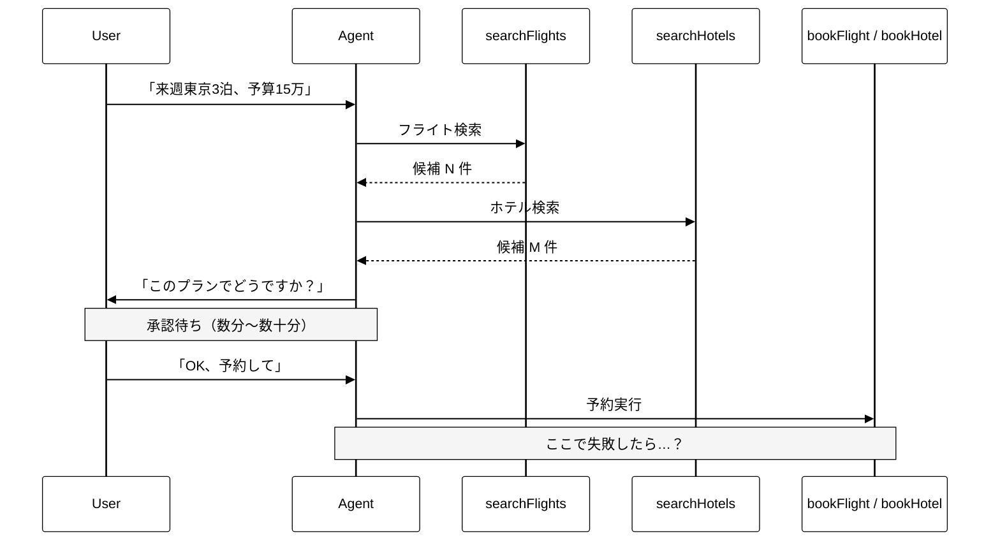
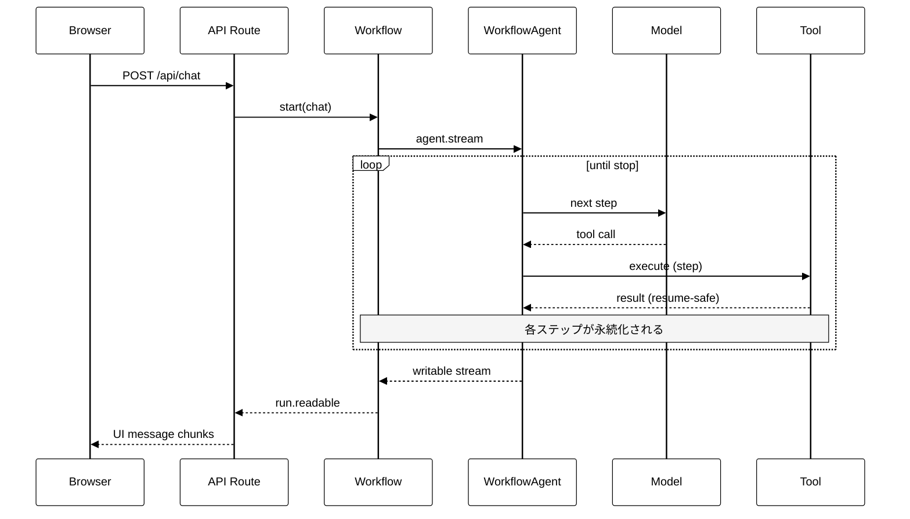
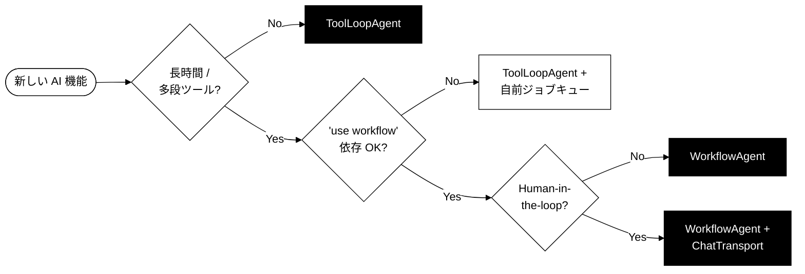

<div class="flex flex-col h-full justify-between">

<div>
  <div class="mm-folio">Vercel · AI SDK 7 stable · 2026-06-25</div>
  <div class="mm-rule-thin mt-2"></div>
</div>

<div class="flex-1 flex flex-col justify-center">
  <div class="mm-display text-[6rem] leading-[1] italic">AI&nbsp;SDK</div>
  <div class="mm-display text-[10rem] leading-[1] italic -mt-2">v7</div>
  <div class="mm-rule-ultra mt-8 w-40"></div>
  <div class="mm-italic text-2xl mt-6 max-w-[36rem]">
    WorkflowAgent を中心に — durable agent の時代へ
  </div>
</div>

<div class="flex justify-between items-end">
  <div class="mm-meta">
    2026 · 06 · TSUBOI HIROKI
  </div>
  <div class="mm-folio">No. 001</div>
</div>

</div>

<!--
AI SDK 7 は 2026-06-25 に stable release。
2026-06-26 確認時点で npm latest は ai@7.0.2、@ai-sdk/workflow@1.0.2。
-->

---
layout: default
---

<div class="mm-folio mb-2">Contents · 目次</div>

# Table of Contents

<div class="grid grid-cols-3 gap-x-10 gap-y-5 mt-5">

<div class="border-t-2 border-black pt-3">
  <div class="mm-folio mb-1">00 · Aside</div>
  <div class="mm-italic text-xl">Versioning</div>
  <div class="text-sm opacity-70">Minor が常に 0 な理由</div>
</div>

<div class="border-t-2 border-black pt-3">
  <div class="mm-folio mb-1">01 · Chapter</div>
  <div class="mm-italic text-xl">Durability</div>
  <div class="text-sm opacity-70">なぜ Durable Agent か</div>
</div>

<div class="border-t-2 border-black pt-3">
  <div class="mm-folio mb-1">02 · Chapter</div>
  <div class="mm-italic text-xl">WorkflowAgent</div>
  <div class="text-sm opacity-70">基本実装と接続方法</div>
</div>

<div class="border-t-2 border-black pt-3">
  <div class="mm-folio mb-1">03 · Interlude</div>
  <div class="mm-italic text-xl">Directives</div>
  <div class="text-sm opacity-70">'use workflow' の系譜</div>
</div>

<div class="border-t-2 border-black pt-3">
  <div class="mm-folio mb-1">04 · Chapter</div>
  <div class="mm-italic text-xl">Catalog</div>
  <div class="text-sm opacity-70">v7 の他の新機能</div>
</div>

<div class="border-t-2 border-black pt-3">
  <div class="mm-folio mb-1">05 · Chapter</div>
  <div class="mm-italic text-xl">Weakness</div>
  <div class="text-sm opacity-70">現実的な弱点</div>
</div>

<div class="border-t-2 border-black pt-3">
  <div class="mm-folio mb-1">06 · Chapter</div>
  <div class="mm-italic text-xl">Roadmap</div>
  <div class="text-sm opacity-70">何を採用すべきか</div>
</div>

<div class="border-t-2 border-black pt-3">
  <div class="mm-folio mb-1">07 · Case Study</div>
  <div class="mm-italic text-xl">Migration</div>
  <div class="text-sm opacity-70">AI Workspace への適用</div>
</div>

<div class="border-t-2 border-black pt-3">
  <div class="mm-folio mb-1">— · Endmatter</div>
  <div class="mm-italic text-xl">Summary</div>
  <div class="text-sm opacity-70">結語と参考文献</div>
</div>

</div>

<div class="absolute bottom-8 right-12 mm-folio">No. 002</div>

---
layout: section
---

<div class="mm-folio opacity-70 mb-4">Aside</div>

# 00 — Versioning

---
layout: default
---

# 公式 Versioning Policy が答え

[ai-sdk.dev/v7/docs/migration-guides/versioning](https://ai-sdk.dev/v7/docs/migration-guides/versioning) に明文化されている

| 種類 | 公式ドキュメントの定義 |
|---|---|
| **Major** | Breaking API updates that require code changes |
| **Minor** | **Blog post that aggregates new features and improvements into a public release** |
| **Patch** | New features and bug fixes |

<v-click>

つまり SemVer の一般的な解釈とは違って:

- **新機能・改善は全部 Patch** に流し込む
- Minor は **「ブログを書く価値がある節目」** のときだけ上げる
- 結果として `5.0.x → 6.0.0` のように **Minor は 0 のまま**

</v-click>

<v-click>

「**新機能がない**」のではなく、Vercel が **Changesets で日次レベルにリリース**しているだけ
（2026-06-26 確認時点で `ai@7.0.2`、`@ai-sdk/workflow@1.0.2`）

</v-click>

---
layout: section
---

<div class="mm-folio opacity-70 mb-4">Chapter</div>

# 01 — Durability

---
layout: default
---

# ToolLoopAgent の限界

`ai` パッケージの標準的な `ToolLoopAgent` は **インメモリ完結** のループ

<v-clicks>

- プロセスが落ちると **進捗は全て消える**
- ツール呼び出しが多段になるほど、再実行コストが跳ね上がる
- 人間の承認を挟むには「待機」が必要だが、サーバーレス環境では難しい
- 実運用で必要になるのは **永続化・再開・観測可能性**

</v-clicks>

<!--
ToolLoopAgent 自体が悪いわけではない。
シンプルなチャットや短いタスクならむしろこれで十分。
本番で多段ツール呼び出しをする時にギャップが出る。
-->

---
layout: default
---

# 例: 「航空券 + ホテル + 人間承認」エージェント

<div class="mm-folio mt-1 mb-2">Scenario · 来週東京3泊、予算15万円</div>



---
layout: default
---

# 悲劇編 vs 理想編

<div class="grid grid-cols-2 gap-x-6 mt-4">

<div class="border-2 border-black p-5">
<div class="mm-folio mb-1">A · ToolLoopAgent</div>
<div class="mm-italic text-2xl mb-3">悲劇編</div>
<ul class="text-sm leading-snug">
<li>承認待ちの間に Vercel が <strong>コールドスタート / デプロイ / クラッシュ</strong></li>
<li>→ プロセス消滅 → <strong>進捗が全部リセット</strong></li>
<li>ユーザーが「OK」と言ったのに、また最初から <strong>「どのフライトが良かったっけ…」</strong> と聞き直し</li>
<li><code v-pre>bookFlight</code> が失敗しても、<strong>検索→提案→承認まで再実行</strong></li>
<li>どのツールがどこで詰まったかは <strong>ログを掘らないと判らない</strong></li>
</ul>
</div>

<div class="mm-invert-panel border-2 border-black p-5">
<div class="mm-folio mb-1 opacity-80">B · WorkflowAgent</div>
<div class="mm-italic text-2xl mb-3">理想編</div>
<ul class="text-sm leading-snug">
<li>承認待ちで <strong><code v-pre>workflow.suspend()</code></strong></li>
<li>ユーザーが承認 → <strong><code v-pre>resume</code></strong> して続きから実行</li>
<li><code v-pre>bookFlight</code> 失敗時は <strong>そのステップだけ自動再試行</strong></li>
<li>検索結果は永続 step なので <strong>再ロード不要</strong></li>
<li>各ツール呼び出しが Workflow ダッシュボードに <strong>独立 step</strong> として記録</li>
</ul>
</div>

</div>

---
layout: default
---

# コードで見る差分

```ts {all|2-3|5-6}
// AI SDK 6 — ToolLoopAgent: 承認待ちで死ぬ
const agent = new ToolLoopAgent({
  tools: { searchFlights, searchHotels, bookFlight, bookHotel },
})
await agent.generate({ prompt: '来週東京3泊、予算15万' })
// ↑ ここで「承認待ち = 数分」のあいだに関数寿命が切れたら全消失
```

```ts {all|2|5|7-12|14}
// AI SDK 7 — WorkflowAgent: サスペンド・再開対応
async function bookFlightStep(input) {
  'use step'
  return bookFlight(input)
}

export async function chat(messages) {
  'use workflow'
  const agent = new WorkflowAgent({
    tools: {
      bookFlight: tool({ execute: bookFlightStep, needsApproval: true }),
    },
  })
  await agent.stream({ messages, writable: getWritable() })
}
// ↑ 承認待ちは workflow.suspend → resume、各 step が独立に retry 可能
```

<div class="mt-1 text-[10px] opacity-75">
  境界: <code v-pre>'use workflow'</code> は実行単位、<code v-pre>'use step'</code> は永続 step、<code v-pre>needsApproval</code> は承認待ちを跨ぐ
</div>

---
layout: default
---

# WorkflowAgent の位置づけ

<div class="mm-slide-lead">
<code v-pre>@ai-sdk/workflow</code> パッケージで提供される <strong>durable</strong> 版エージェント
</div>

| 観点 | ToolLoopAgent (`ai`) | WorkflowAgent (`@ai-sdk/workflow`) |
|---|---|---|
| ランタイム | インメモリ | Workflow runtime（World が queue / 永続化を担当） |
| 耐障害性 | プロセス落ちで全消失 | **再起動を跨いで生存** |
| ツール再試行 | 手動 | **ステップ単位で自動** |
| Human-in-the-loop | あり | あり + **サスペンド越えで生存** |
| `generate()` | あり | **未実装**（`throw new Error`） |
| `stream()` | あり | プライマリ API |
| 出力 | streamText の戻り値 | `writable` パラメタに `ModelCallStreamPart` |

<div class="mt-2 text-[10px] opacity-80">
World = Workflow DevKit の実行バックエンド。Local World は開発用、Vercel World は Vercel 上の managed backend。
</div>

<!--
"durable" を翻訳すれば「永続的・耐久性のある」。
要するに ToolLoopAgent と同じループを、各ツール呼び出しが workflow ステップになる形で実行する。
-->

---
layout: default
---

# 解決したい4つの問題

公式ドキュメント [ai-sdk.dev/v7/docs/agents/workflow-agent](https://ai-sdk.dev/v7/docs/agents/workflow-agent) より

<v-clicks>

1. **Statefulness** — プロセス境界を跨いで状態を保持
2. **Resumability** — 失敗したステップから再開（最初からやり直さない）
3. **Human-in-the-loop** — 承認待ちで一時停止し、後で再開
4. **Observability** — 各ツール呼び出しが独立したワークフローステップとして可視化

</v-clicks>

---
layout: section
---

<div class="mm-folio opacity-70 mb-4">Chapter</div>

# 02 — WorkflowAgent の基本実装

Agent 本体、API ルート、再接続 Transport の3点だけ見る

---
layout: default
---

# WorkflowAgent は workflow 関数の中で動かす

```ts {all|1-4|6-8|10-17|19-22|all}
async function bookFlightStep(input) {
  'use step'
  return bookFlight(input)
}

export async function chat(messages: UIMessage[]) {
  'use workflow'
  const modelMessages = await convertToModelMessages(messages)
  const agent = new WorkflowAgent({
    model: 'anthropic/claude-sonnet-4-6',
    tools: {
      searchFlights: tool({ execute: searchFlightsStep }),
      bookFlight: tool({
        needsApproval: true,
        execute: bookFlightStep,
      }),
    },
  })
  const result = await agent.stream({
    messages: modelMessages,
    writable: getWritable<ModelCallStreamPart>(),
  })
  return { messages: result.messages }
}
```

---
layout: default
---

# API ルートは Workflow を起動するだけ

```ts {all|1-3|7|9|11-13|all}
import { createModelCallToUIChunkTransform } from '@ai-sdk/workflow'
import { createUIMessageStreamResponse, type UIMessage } from 'ai'
import { start } from 'workflow/api'
import { chat } from '@/workflow/agent-chat'

export async function POST(request: Request) {
  const { messages }: { messages: UIMessage[] } = await request.json()

  const run = await start(chat, [messages])

  return createUIMessageStreamResponse({
    stream: run.readable.pipeThrough(createModelCallToUIChunkTransform()),
    headers: { 'x-workflow-run-id': run.runId },
  })
}
```

`createModelCallToUIChunkTransform()` で生の `ModelCallStreamPart` を **UI 用チャンクに変換**

---
layout: default
---

# 実行フロー



---
layout: default
---

# 切れても再開する: WorkflowChatTransport

```tsx {all|1-4|7-10|12-13|all}
'use client'
import { useChat } from '@ai-sdk/react'
import { WorkflowChatTransport } from '@ai-sdk/workflow'
import { useMemo } from 'react'

export default function Chat() {
  const transport = useMemo(
    () => new WorkflowChatTransport({
      api: '/api/chat',
      maxConsecutiveErrors: 5,
      initialStartIndex: -50,
    }),
    [],
  )

  const { messages, sendMessage } = useChat({ transport })
  // ストリームが finish イベントなしで切れたら自動再接続して "続きから" 再開
  return (/* ... */)
}
```

公式ガイド例では `useMemo` あり。必須 API ではなく、transport identity を安定させるため。POST は `x-workflow-run-id` を返し、`GET /api/chat/{runId}/stream` で同じ run の readable を再取得する

<!--
通常の useChat の transport を WorkflowChatTransport に差し替えた上で、サーバー側に reconnect endpoint を生やす。
サーバー側で何分かかっても、長時間ストリームが途切れても自動復旧する。
-->

---
layout: default
---

# AI SDK 7 stable release highlights

2026-06-25 の公式 blog で **AI SDK 7 stable** として発表

<v-clicks>

- **Develop** — `reasoning`、typed tool / runtime context、provider file / skill uploads、MCP Apps、TUI
- **Run** — tool approvals、`WorkflowAgent`、timeouts、sandbox support
- **Integrate** — Codex / Claude Code / Deep Agents / OpenCode / Pi など任意の agent harness
- **Observe** — telemetry、Node.js tracing channel、lifecycle events、performance statistics
- **Beyond text** — provider-agnostic realtime voice、experimental video generation

</v-clicks>

<v-click>

WorkflowAgent は「Run agents」の中核。beta 時代の細かい差分より、  
**production agent stack の一部として stable 化した**ことが今回の大きな変化

</v-click>

---
layout: section
---

<div class="mm-folio opacity-70 mb-4">Interlude</div>

# 03 — Directives

<div class="mt-6 text-xl italic opacity-90 max-w-[40rem]">
  `'use workflow'` は Next.js 専用機能ではなく、React 起源のディレクティブパターンが膨らんだもの
</div>

---
layout: default
---

# 'use workflow' は突然変異ではない

ディレクティブの系譜を追うと、**ECMAScript → React → Next.js → Vercel** と層を超えて増殖してきた

| ディレクティブ | 出自 | 役割 |
|---|---|---|
| `"use strict"` | ECMAScript 5 (2009) | 厳格モード（**唯一の標準化済み**） |
| `"use asm"` | asm.js (2013, Mozilla) | パフォーマンスヒント。WASM に置き換えられ消滅 |
| `"use client"` | React Server Components (2023) | Client Component 境界 |
| `"use server"` | React Server Components (2023) | Server Action / Function 境界 |
| `"use memo"` / `"use no memo"` | React Compiler (2024) | コンパイル対象制御（escape hatch） |
| `"use cache"` | Next.js 15 / Cache Components (2024) | キャッシュ境界 |
| `"use workflow"` / `"use step"` | Vercel Workflow SDK (2025) | 永続実行境界 |

<v-click>

最初は ECMAScript 標準だったのに、**フレームワーク・ランタイムが各々増やしている**現状

</v-click>

---
layout: default
---

# なぜディレクティブなのか

技術的には合理的な選択

<v-clicks>

- **静的解析可能** — コンパイル時にバンドラ/コンパイラが拾える
- **runtime inert** — 実行時はただの文字列、評価されない
- **minify を生き残る** — コンパイラが保持する
- **関数シグネチャを変えない** — decorator より構文的に軽量
- **モジュール境界を明示** — import/export より宣言的

</v-clicks>

<v-click>

ただし React Compiler の **公式定義** ([react.dev](https://react.dev/reference/react-compiler/directives)) は控えめ:

> Directives are escape hatches.  
> Prefer configuring the compiler at the project level.

つまり React 自身は **「控えめに使うべき」** と言っているが、エコシステムは逆方向に走っている

</v-click>

---
layout: default
---

# WorkflowAgent と 'use workflow' の本質

`WorkflowAgent` は **ライブラリコードだけでは durable にならない**

```ts {all|2|4-5|all}
export async function chat(messages: UIMessage[]) {
  'use workflow'                    // ← これが無いと普通の関数

  const agent = new WorkflowAgent({ /* ... */ })
  const result = await agent.stream({ /* ... */ })
  return { messages: result.messages }
}
```

<v-clicks>

- `'use workflow'` ディレクティブが **コンパイラ/ランタイムに「この関数を Workflow ステップ化せよ」** と指示
- 関数本体は **state machine 相当のコードに変換**される（クラッシュからの再開のため）
- WorkflowAgent は **その変換が起きていることを前提に動作**
- → ライブラリ・runtime・directive が **3 点セットで結合**

</v-clicks>

---
layout: default
---

# 増殖の問題（zenn 記事より）

[zenn.dev/tsuboi/articles/3f00d532bcb4dc](https://zenn.dev/tsuboi/articles/3f00d532bcb4dc) の主張:

<v-clicks>

> `'use strict'` は ES5 で標準化されたが、`'use client'` 以降は **バンドラが解釈する独自仕様**。  
> 標準に見えて出所不明。

</v-clicks>

<v-click>

Tanner Linsley (TanStack 作者) の評価:

> これは **新しい形のフレームワークロックイン** だ

</v-click>

<v-click>

歴史的類比 — **2015 年の TS/Babel デコレータ**:

- 広く採用された
- TC39 標準と非互換
- 大規模な移行コスト
- ディレクティブも同じ道を辿る可能性

</v-click>

---
layout: default
---

# ニュアンス — Workflow SDK は実は portable

調査して分かった重要な事実: **`'use workflow'` は Vercel 完全ロックインではない**

<v-clicks>

- Workflow SDK には **"Worlds" という pluggable backend 抽象化** がある
- 公式サポート: **Vercel / AWS / DigitalOcean / Docker / 自前ホスト**
- コミュニティ実装も存在（例: [karthikscale3/aws-workflow](https://github.com/karthikscale3/aws-workflow) — AWS Lambda + DynamoDB + SQS + S3）
- 公式ドキュメントの謳い文句:

</v-clicks>

<v-click>

> Run locally, self-host, or swap every component — Workflow SDK is fully portable.

</v-click>

<v-click>

つまり実態は:

- ❌ "Vercel に強くロックイン" は誇張
- ✅ "**Workflow SDK の directive 仕様**" にロックイン
- ✅ AI SDK の `WorkflowAgent` の **ドキュメントが Vercel World 前提で書かれている** だけ

</v-click>

---
layout: default
---

# 採用するときの実践的指針

<v-clicks>

1. **境界を明示** — どのファイルが durable で、どれが純粋関数なのか
2. **抽象化レイヤーを噛ませる** — `'use workflow'` を持つファイルを「境界モジュール」として隔離
3. **テスト戦略を分ける** — directive は単体テストでは効かない、E2E が必要
4. **チーム内リファレンス** — 各 directive が何者なのか文書化
5. **ロックインの方向を意識** — 何にロックインしているかを把握（Vercel? Workflow SDK? React?）

</v-clicks>

<v-click>

> ディレクティブは便利。でも **「JS 標準ではない」** という事実は常に頭に置く

</v-click>

---
layout: section
---

<div class="mm-folio opacity-70 mb-4">Chapter</div>

# 04 — Catalog

<div class="mt-6 text-xl italic opacity-90 max-w-[40rem]">
  WorkflowAgent 以外にも Agent 周りが大幅に進化
</div>

---
layout: default
---

# Subagents — 公式パターン化

親エージェントが **tool の `execute` から子Agentを呼ぶ** パターンを公式ドキュメント化

<div class="text-xs opacity-80 mt-1">
Docs: <a href="https://ai-sdk.dev/v7/docs/agents/subagents">ai-sdk.dev/v7/docs/agents/subagents</a>
</div>

<v-clicks>

- 子は **独立した context window** を持つ → 探索ログを親に抱えさせない
- `toModelOutput` で **親が見る要約だけを返せる**（総tokenは減らず、親contextを守る）
- 並列リサーチ / Tool 権限分離を自然に書ける

</v-clicks>

<v-click>

```ts {all|4-7|9}
const research = tool({
  inputSchema: z.object({ topic: z.string() }),
  execute: async ({ topic }, { abortSignal }) => {
    const r = await new ToolLoopAgent({
      model,
      tools: { searchWeb, readUrl },
    }).generate({ prompt: topic, abortSignal })
    return r.text
  },
  toModelOutput: ({ output }) => output.slice(0, 1000),
})
```

</v-click>

---
layout: default
---

# 型付き Context: 何が嬉しい？

ツールが必要なサーバー側の値を **schema として宣言** できる

<div class="grid grid-cols-2 gap-5 mt-4">

<div>
<div class="mm-folio mb-2">Before · 旧実装</div>

```ts
const apiKey = process.env.WEATHER_API_KEY!
const weather = tool({
  inputSchema: z.object({ location: z.string() }),
  execute: async ({ location }) =>
    getWeather(location, apiKey),
})
```

- 外側の値に暗黙依存
- tool単体で必要な値が読めない
- テストや差し替えで壊れやすい
</div>

<div>
<div class="mm-folio mb-2">After · AI SDK 7</div>

```ts
const weather = tool({
  inputSchema: z.object({ location: z.string() }),
  contextSchema: z.object({ apiKey: z.string() }),
  execute: async ({ location }, { context }) =>
    getWeather(location, context.apiKey),
})

await agent.generate({
  prompt,
  toolsContext: {
    weather: { apiKey: process.env.WEATHER_API_KEY! },
  },
})
```
</div>

</div>

<v-click>

<div class="mt-3 text-sm opacity-90">
嬉しさ: `execute` の `context` に型推論が効く。ツールごとに必要な権限・API key を分離でき、WorkflowAgent では <strong>serializable な値</strong> として step 境界を越えやすい。
</div>

</v-click>

---
layout: default
---

# ツール承認 API の刷新

`generateText` / `streamText` / `ToolLoopAgent` は  
`tool({ needsApproval })` → **呼び出し側の `toolApproval`** に移動

```ts {all|2-7|10-16}
// AI SDK 6 — 承認ロジックがツール定義に固定されていた
const deleteFile = tool({
  inputSchema: z.object({ path: z.string() }),
  needsApproval: async ({ path }) => !path.startsWith('/tmp/'),
  execute: async ({ path }) => removeFile(path),
})

// AI SDK 7 — 呼び出し側で承認ポリシーを決める
await streamText({
  model,
  tools: { deleteFile },
  toolApproval: {
    deleteFile: async ({ path }) =>
      path.startsWith('/tmp/') ? undefined : 'user-approval',
  },
})
```

<div class="mt-3 text-sm opacity-85">
  承認ポリシーを <strong>リクエスト単位</strong> で差し替えられる。例外として <code v-pre>WorkflowAgent</code> は suspend/resume と結合するため、最新 docs でも <code v-pre>needsApproval</code> を使う
</div>

---
layout: default
---

# Agent の動的設定: callOptionsSchema + prepareCall

エージェントに **「ランタイム入力のスキーマ」** を持たせる

```ts {all|3-6|7-10|14-17}
const supportAgent = new ToolLoopAgent({
  model,
  callOptionsSchema: z.object({
    userId: z.string(),
    accountType: z.enum(['free', 'pro', 'enterprise']),
  }),
  prepareCall: ({ options, ...settings }) => ({
    ...settings,
    instructions: `${settings.instructions}\nAccount: ${options.accountType}`,
  }),
})

await supportAgent.generate({
  prompt: 'How do I upgrade?',
  options: { userId: 'u_123', accountType: 'pro' },
})
```

モデル選択・instructions・tools を **リクエスト単位で型安全に** 切り替えられる

---
layout: default
---

# Memory — 3 つの使い分け

<div class="text-xs opacity-80 -mt-2 mb-4">
Docs: <a href="https://ai-sdk.dev/v7/docs/agents/memory">ai-sdk.dev/v7/docs/agents/memory</a>
</div>

| アプローチ | 何を任せる？ | 選ぶとき |
|---|---|---|
| **Provider-defined tools**<br/>例: Anthropic Memory Tool | モデルに memory 操作の判断を任せる。自分は保存先を実装 | Claude 前提で、最小実装にしたい |
| **Memory providers**<br/>例: Letta / Mem0 | 外部 provider に抽出・検索・注入を任せる | 既製の長期記憶基盤や管理画面を使いたい |
| **Custom tool** | schema、検索、保存、権限、監査を自前で持つ | DB/RAG/権限制御を完全に握りたい |

<div class="mt-4 border-2 border-black p-4 text-sm leading-snug">
<strong>Anthropic Memory Tool の嬉しさ:</strong>
Claude が知っている `/memories` IF（`view/create/replace` 等）を使える。
独自 memory tool の schema 設計をかなり省ける一方、Claude 専用の provider lock-in は受け入れる。
</div>

---
layout: default
---

# Telemetry の正式化

<v-clicks>

- `experimental_telemetry` → **`telemetry`**（stable 化、リネーム）
- OpenTelemetry が **`@ai-sdk/otel`** に分離
- `registerTelemetry(new OpenTelemetry())` をアプリ起動時に**一度だけ**
- 登録済みなら **デフォルト on**（オプトアウト方式に変わった）
- `tracer` プロパティは削除 → `OpenTelemetry` コンストラクタへ

</v-clicks>

<v-click>

```ts {all|1-2|4|6-12}
import { registerTelemetry } from 'ai'
import { OpenTelemetry } from '@ai-sdk/otel'

registerTelemetry(new OpenTelemetry())  // instrumentation.ts で一回だけ

const result = await generateText({
  model, prompt: 'Hello',
  telemetry: {                           // experimental_ プレフィックス不要
    functionId: 'story-agent',
  },
})
```

</v-click>

---
layout: default
---

# その他の整理（ざっくり）

<v-clicks>

- **ESM only** — CommonJS（`require()`）廃止、`type: "module"` 必須
- **Node.js 22+ 必須** — 18 / 20 はサポート外、本番は 24 LTS / 26 推奨
- **画像・音声 API の stable 化** — `generateImage` / `generateSpeech` / `transcribe`
- **Realtime API** — OpenAI / Google / xAI の speech-to-speech 系を experimental 提供
- **lifecycle rename** — `onFinish` → `onEnd`、`onStepFinish` → `onStepEnd`
- **`reasoning` トップレベルオプション** — provider 横断で reasoning effort 制御
- **メッセージ部品の統一** — `image-*` → `file-*` に統合（画像も "image media type を持つ file"）
- **`reasoning-file` 新設** — 推論トレース内で参照されるファイル用の専用タイプ
- **System message 安全化** — `messages: [{ role: 'system' }]` をデフォルト拒否（プロンプトインジェクション対策）
- **MCP のセキュリティ強化** — HTTP redirect デフォルトが `'follow'` → `'error'`（SSRF 対策）
- **stop condition リネーム** — `stepCountIs` → `isStepCount`

</v-clicks>

---
layout: default
---

# Provider 側の v7 変更

<v-click>

**Anthropic**

- `providerMetadata.anthropic.cacheCreationInputTokens` 削除
- → 標準 `usage.inputTokenDetails.cacheWriteTokens` / `cacheReadTokens` に統合
- 生の Anthropic ペイロードは `providerMetadata.anthropic.usage` に残る

</v-click>

<v-click>

**Google**

- `GoogleGenerativeAI*` → `Google*` に **affix を削除**
- 例: `createGoogleGenerativeAI` → `createGoogle`、`GoogleGenerativeAIProvider` → `GoogleProvider`
- 旧名はエイリアスとして残るが、移行推奨
- `google` 定数自体は変更なし

</v-click>

---
layout: section
---

<div class="mm-folio opacity-70 mb-4">Chapter</div>

# 05 — Weakness

<div class="mt-6 text-xl italic opacity-90 max-w-[40rem]">
  調査した結果、コメントの主張と実装に乖離があった
</div>

---
layout: default
---

# ファクトチェック結果

外部レビューで主張されていた点を、ソースで一次確認した結果

| 主張 | 実態 |
|---|---|
| WorkflowAgent に **Subagent 第一級 API** が入った | ❌ CHANGELOG / docs / ソースで**裏付けなし**。専用 API は存在しない |
| **`toolsContext` のサポート**が WorkflowAgent に入っている | ✅ v7 stable docs で対応済み。ただし workflow 境界を跨ぐため **serializable 前提** |
| **`generate()` が無いのは本物のギャップ** | ✅ ソースで `throw new Error('Not implemented')` を確認 |
| **Vercel Workflow への完全ロックイン** | △ 当初そう書いたが、実は **Workflow SDK の "Worlds" 抽象化** で AWS / DigitalOcean / Docker / 自前ホストも可能。AI SDK の docs が Vercel World 前提なだけ |

<!--
LLM が生成した「最新動向」をそのまま信じない。
必ず一次情報（ソースとCHANGELOG）で裏取りする習慣が大事。
-->

---
layout: default
---

# 現実的なギャップ（優先度順）

| 課題 | 深刻度 | 影響 |
|---|---|---|
| Workflow SDK の directive 仕様への暗黙の依存 | ★★★ | Worlds 抽象化で backend は差替え可能だが、directive そのものへの依存は残る |
| `stream()` のみで `generate()` が無い | ★★★★ | シンプルな同期処理が書きにくい |
| Subagent との統合がまだ無い | ★★★ | マルチエージェントを durable にするのが面倒 |
| context は serializable 前提 | ★★★ | DB client / SDK client など live object は step 内で再生成が必要 |
| WorkflowAgent だけ承認 API が `needsApproval` | ★★ | 他 API の `toolApproval` と覚え分けが必要 |
| workflow run と外部 APM の紐付け | ★★ | AI SDK 側 telemetry は強化。Workflow の runId / step / tool trace の設計は別途必要 |

---
layout: default
---

# Stable 後に欲しい改善

<v-clicks>

1. **`generate()` の提供** — `stream()` をラップして最後の結果だけ返せば実装可能なはず
2. **Subagents の第一級サポート** — `createSubagent()` のような API で「親 durable・子も durable」を自然に書きたい
3. **AI SDK レベルでの "World" 公式サポート** — Workflow SDK 側に Worlds は既にあるので、AI SDK のドキュメントでも非 Vercel World の例を提示してほしい
4. **WorkflowAgent の observability recipe** — `runId` / step / tool / model call を外部 APM と紐付ける定石
5. **承認 UI のテンプレート** — `x-workflow-run-id` と reconnect endpoint まで含む標準パターン
6. **非 serializable resource の定石** — context ではなく step 内再接続、という公式パターン

</v-clicks>

<v-click>

> 理想形: **「ToolLoopAgent と同じ API で書けるが、必要に応じて耐障害性をオンにできる」**  
> そして **Vercel 以外でも動く** 選択肢がある

</v-click>

---
layout: section
---

<div class="mm-folio opacity-70 mb-4">Chapter</div>

# 06 — Roadmap

<div class="mt-6 text-xl italic opacity-90 max-w-[40rem]">
  いま何を採用すべきか
</div>

---
layout: default
---

# 採用判断のフローチャート



<v-click>

開発フローのベストプラクティス:  
**まず ToolLoopAgent で書く → durable 化が必要になったら WorkflowAgent に切替**

</v-click>

---
layout: default
---

# 移行のコツ — v6 → v7 で最初にやるべき6つ

<v-clicks>

1. **Node.js 22+ / ESM 化** — CJS `require()` は廃止、`"type": "module"` へ
2. **`system` → `instructions`** — `messages` 内の `{ role: 'system' }` はデフォルト拒否
3. **lifecycle rename** — `onFinish` → `onEnd`、`onStepFinish` → `onStepEnd`
4. **context 分割** — `experimental_context` → `runtimeContext` / `toolsContext`
5. **承認 API を分ける** — 通常は `toolApproval`、WorkflowAgent は `tool({ needsApproval })`
6. **Telemetry の登録** — `@ai-sdk/otel` を入れて `registerTelemetry()` を一回呼ぶ

</v-clicks>

<v-click>

まず `npx @ai-sdk/codemod v7` をかける。`image-*` 系は runtime auto-migration ありだが、最終的には canonical `file` part へ寄せる

</v-click>

---
layout: section
---

<div class="mm-folio opacity-70 mb-4">Case Study</div>

# 07 — Migration

<div class="mt-6 text-xl italic opacity-90 max-w-[44rem]">
  AI Workspace の <code style="background:rgba(255,255,255,0.12);padding:0 0.4em">route.ts</code> を WorkflowAgent に置き換える
</div>

---
layout: default
---

# 想定: いまの ToolLoopAgent ベース

<div class="mm-folio mt-1 mb-2">Before · 1 リクエスト = 1 関数実行</div>

```text
Browser ─POST─▶ /api/chat/.../agent
                ├─ MCP / skill / memory 並列ロード
                ├─ buildAgent → agent.stream({ totalMs: 540s })
                │   ├─ onStepFinish: HMAC 署名 / RAG ref / skill log
                │   ├─ prepareStep:  reasoning signature 修復
                │   └─ onFinish:    DynamoDB upsert / AgentCore Memory / title
                ├─ try/catch: input-too-long / docsize → retry-without-files で agent 再生成
                └─ pipeJsonRender → toUIMessageStream → writer 直書き

HITL のとき:
Browser ◀─署名つき approval prompt─ writer
Browser ─POST── approvalContinuation { messages 全部 }
        ▶ parseApprovalContinuation → HMAC 検証 → resolveApprovalContinuationMessages
        → 上の流れを最初から再構築（system prompt 再生成・MCP 再接続・履歴再ロード）
```

---
layout: default
---

# After: WorkflowAgent + 'use workflow'

<div class="mm-folio mt-1 mb-2">After · workflow run（永続・関数寿命と独立）</div>

```text
Browser ─POST─▶ /api/chat/.../agent  ← 薄くなる（start(chat) して stream 配管）
                  │
                  ▼
           workflow run（永続・関数寿命と独立）
           ├─ step: prepareContext        ← 履歴 / memory / MCP / skill ロード（1 回だけ）
           ├─ step: buildSystemPrompt
           ├─ WorkflowAgent.stream({ writable }) ← 各ツール呼び出しが独立 step
           │   ├─ step: tool call A       ← 失敗したらこの step だけ retry
           │   ├─ step: tool call B (destructive) → workflow.suspend()
           │   │           ▲   Browser ◀─ 「承認待ち」イベント
           │   │           │   Browser ─POST /agent/resume { runId, decision (HMAC) }
           │   │           ▼   workflow resume（messages を再送しない）
           │   ├─ step: tool call C
           │   └─ ...
           ├─ step: persistAssistant     ← DynamoDB / AgentCore Memory / title
           └─ done
                  │
                  ▼
        run.readable ─▶ createModelCallToUIChunkTransform ─▶ Browser
        WorkflowChatTransport が切断時に同じ run へ再接続
```

---
layout: default
---

# 既知のペインポイント、何個消えるか

| いまの制約 (`route.ts` のコメント) | WorkflowAgent 化での扱い |
|---|---|
| Bedrock Claude p99 5 分超で 540s に張り付き | **解消** — step は関数寿命を超えて継続 |
| timeout 発動時 `onFinish` バイパスで部分応答が保存されない | **解消** — 各 step が永続化、最後の保存 step は必ず走る |
| `ToolLoopAgent` は `onAbort` 未サポート ([vercel/ai#12117](https://github.com/vercel/ai/issues/12117)) | **回避不要** — abort ではなく step ごと durable |
| `reader.cancel()` 後の `onFinish` 未文書化 → 二重保存ガード | **不要** — 保存は最終 step で 1 回 |
| MCP クライアント `try/finally` cleanup（リーク防止） | **構造的に楽** — step 単位で lifecycle / `runtimeContext` 共有 |
| `retry-without-files` の二重 `buildAgent` | **不要** — 同一 agent に messages 差し替え step を噛ませる |
| HITL: `parseApprovalContinuation` / `sanitizeApprovalMessages` 200 行超 | **大幅縮退** — `suspend/resume` + HMAC（決定の改ざん検知）だけ |
| `prepareStep` で reasoning signature 修復 | **そのまま** — v7 で `prepareStep` stable 化 |
| `experimental_telemetry` で Langfuse | **`telemetry` リネームのみ** — 各 step が workflow dashboard でも可視化 |

---
layout: default
---

# 具体的なメリット

<div class="grid grid-cols-3 gap-x-8 mt-4">

<div>
<div class="mm-folio mb-1">A · UX</div>
<div class="mm-italic text-xl mb-2">ユーザー体感</div>

- **タブ閉じても応答が消えない** — `WorkflowChatTransport` で同 run に再接続。長時間 Bedrock 待ちでもロストしない
- **承認後のレイテンシが落ちる** — system prompt 再構築・履歴 hydrate が無くなり、文脈をそのまま継続
- **長文回答が切れない** — 540s の壁が事実上消える

</div>

<div>
<div class="mm-folio mb-1">B · Ops</div>
<div class="mm-italic text-xl mb-2">運用・デバッグ</div>

- **詰まった kintone ツールが一発で見える** — Workflow ダッシュボードに step 単位 timeline
- **MCP gateway 一時障害でリトライ可能** — 失敗した step だけ自動再試行、会話まるごと失敗しない
- **input-too-long 等のフォールバックが宣言的** — `try/catch` ネスト → 「失敗したら次の step」

</div>

<div>
<div class="mm-folio mb-1">C · Code</div>
<div class="mm-italic text-xl mb-2">コード量</div>

- **`hitlUtils.ts` / `sanitizeApprovalMessages.ts` の半分以上が消える** — 承認継続フロー再構築コードが大半
- **`buildAgent` ファクトリの二重生成が消える** — retry-without-files も同 agent への再 stream で済む
- **`assistantPersistedForTurn` 二重保存ガードが不要** — 最終 step が保存

</div>

</div>

---
layout: default
---

# 移行後コード骨子

```ts {all|1|4-5|7-14|16-19|21}
'use workflow'

export async function agentChat(input: AgentChatInput) {
  const ctx = await prepareContext(input)

  const agent = new WorkflowAgent({
    id: `mhi-${input.agentType}`,
    model: createLanguageModel(input.model),
    instructions: ctx.system,
    stopWhen: isStepCount(input.maxSteps ?? 10),
    tools: ctx.workflowTools,
    runtimeContext: { requestId: input.requestId },
    toolsContext: ctx.toolsContext,
    prepareStep: repairReasoning,
  })

  const result = await agent.stream({
    messages: ctx.modelMessages,
    writable: getWritable<ModelCallStreamPart>(),
  })

  await persistAssistant(result, ctx)
  return { messages: result.messages }
}
```

---
layout: default
---

# 呼び出し側はぐっと薄く

```ts {all|3-4|6}
// frontend/app/api/chat/histories/[historyId]/agent/route.ts
export async function POST(req: Request) {
  const input = await parseInput(req)
  const run = await start(agentChat, [input])
  return createUIMessageStreamResponse({
    stream: run.readable.pipeThrough(createModelCallToUIChunkTransform()),
    headers: { 'x-workflow-run-id': run.runId },
  })
}
```

<div class="mt-2 text-sm opacity-80">
  reconnect 用に <code>GET .../agent/{runId}/stream</code> も用意し、<code>getRun(runId).getReadable({ startIndex })</code> を返す
</div>

```ts {all|3|4|5}
// 新設: .../agent/resume/route.ts  — HITL 継続は超薄い
export async function POST(req: Request) {
  const { runId, decision } = await req.json()
  verifyHmac(decision)                                  // 改ざん検知だけ残す
  await resume(runId, { approval: decision })
  return new Response(null, { status: 204 })
}
```

<div class="mt-3 text-sm opacity-80">
  → <code>messages</code> 全量再送・再 hydrate が消える。承認 UI は <code>runId</code> と HMAC 署名つき decision だけ POST すれば済む
</div>

---
layout: default
---

# 残課題（stable 後でも検証が要る点）

<v-clicks>

- **`smoothStream` 互換** — `ModelCallStreamPart` ストリームへの transform を入れる位置が変わる
- **`pipeJsonRender`（独自 JSONL 抽出）と `createModelCallToUIChunkTransform` の合流ポイント**設計
- **AgentCore Memory への `sendConversationEvents`** を最終 step に置くか、別 workflow に切り出すか
- **DynamoDB upsert の冪等性** — step retry が走る場合に備えて `id` を固定化
- **`wrapToolsWithStages` の `data-search-stage` / `data-reference-data`** を `ModelCallStreamPart` 経由でどう乗せるか

</v-clicks>

<v-click>

<div class="mt-6 mm-folio">Summary</div>

> いまのコードに散在する **「ToolLoopAgent の制約に対応するための気合いコード」** が、  
> WorkflowAgent の永続性を前提にすると **体系的に縮退する**

</v-click>

---
layout: default
---

<div class="mm-folio mb-2">Summary · 結語</div>

# Takeaways

<div class="grid grid-cols-3 gap-x-10 gap-y-4 mt-5">

<div>
<div class="mm-folio mb-1">01</div>
<div class="mm-italic text-xl">Versioning</div>
<div class="text-sm">Minor は「ブログを書く節目」専用。開発自体は Patch でアクティブ</div>
</div>

<div>
<div class="mm-folio mb-1">02</div>
<div class="mm-italic text-xl">WorkflowAgent</div>
<div class="text-sm">ToolLoopAgent の durable 版。永続化・再開・承認を任せられる</div>
</div>

<div>
<div class="mm-folio mb-1">03</div>
<div class="mm-italic text-xl">Directives</div>
<div class="text-sm">React 起源の系譜が膨張。だが Workflow SDK は Worlds で portable</div>
</div>

<div>
<div class="mm-folio mb-1">04</div>
<div class="mm-italic text-xl">v7 Catalog</div>
<div class="text-sm">reasoning / context / approvals / WorkflowAgent / Memory / MCP Apps / uploads / observability</div>
</div>

<div>
<div class="mm-folio mb-1">05</div>
<div class="mm-italic text-xl">Strategy</div>
<div class="text-sm">ToolLoopAgent で開発 → 必要なら WorkflowAgent + 任意 World</div>
</div>

<div>
<div class="mm-folio mb-1">06</div>
<div class="mm-italic text-xl">Migration</div>
<div class="text-sm">AI Workspace の気合いコードは WorkflowAgent で体系的に縮退する</div>
</div>

<div>
<div class="mm-folio mb-1">07</div>
<div class="mm-italic text-xl">Discipline</div>
<div class="text-sm">LLM の「最新動向」要約は必ず一次情報で裏取りする — 自分の主張も含めて</div>
</div>

</div>

---
layout: default
---

<div class="mm-folio mb-2">References · 参考文献</div>

# Bibliography

<div class="grid grid-cols-2 gap-x-12 mt-4">

<div>
<div class="mm-folio mb-1 text-[10px]">AI SDK</div>

- [AI SDK 7 Blog](https://vercel.com/blog/ai-sdk-7)
- [AI SDK Versioning Policy](https://ai-sdk.dev/v7/docs/migration-guides/versioning)
- [WorkflowAgent ガイド](https://ai-sdk.dev/v7/docs/agents/workflow-agent)
- [v7 Migration Guide](https://ai-sdk.dev/v7/docs/migration-guides/migration-guide-7-0)
- [Subagents](https://ai-sdk.dev/v7/docs/agents/subagents)
- [Memory](https://ai-sdk.dev/v7/docs/agents/memory)
- [Loop Control](https://ai-sdk.dev/v7/docs/agents/loop-control)
- [Call Options](https://ai-sdk.dev/v7/docs/agents/configuring-call-options)
- [vercel/ai](https://github.com/vercel/ai)
- [`@ai-sdk/workflow` CHANGELOG](https://github.com/vercel/ai/blob/main/packages/workflow/CHANGELOG.md)

</div>

<div>
<div class="mm-folio mb-1 text-[10px]">Directives & Workflow</div>

- [React Compiler Directives](https://react.dev/reference/react-compiler/directives)
- [zenn: ディレクティブ問題](https://zenn.dev/tsuboi/articles/3f00d532bcb4dc)
- [Workflow SDK (workflow-sdk.dev)](https://workflow-sdk.dev)
- [vercel/workflow (GitHub)](https://github.com/vercel/workflow)
- [aws-workflow — AWS World 実装](https://github.com/karthikscale3/aws-workflow)

</div>

</div>

---
layout: end
---

<div class="flex flex-col items-center justify-center h-full">
  <div class="mm-folio opacity-70 mb-8">End · 終</div>
  <div class="mm-display text-[14rem] leading-none italic">Fin.</div>
  <div class="mm-rule-ultra mt-8 w-32" style="border-color: #ffffff; border-top-width: 8px;"></div>
  <div class="mm-folio mt-8 opacity-70">Q&amp;A</div>
</div>
