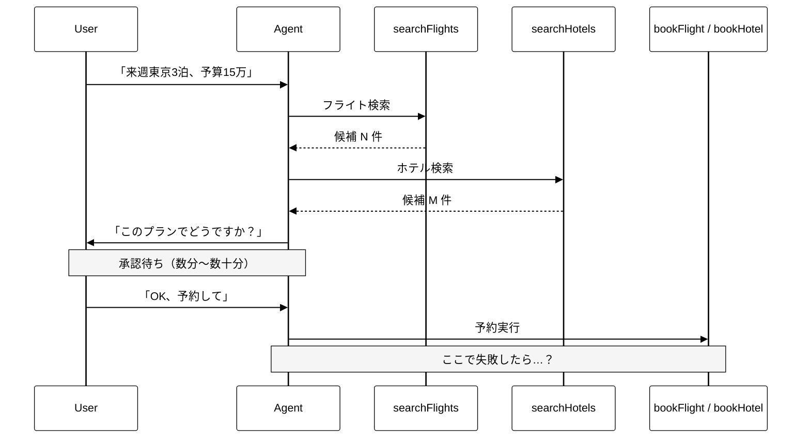
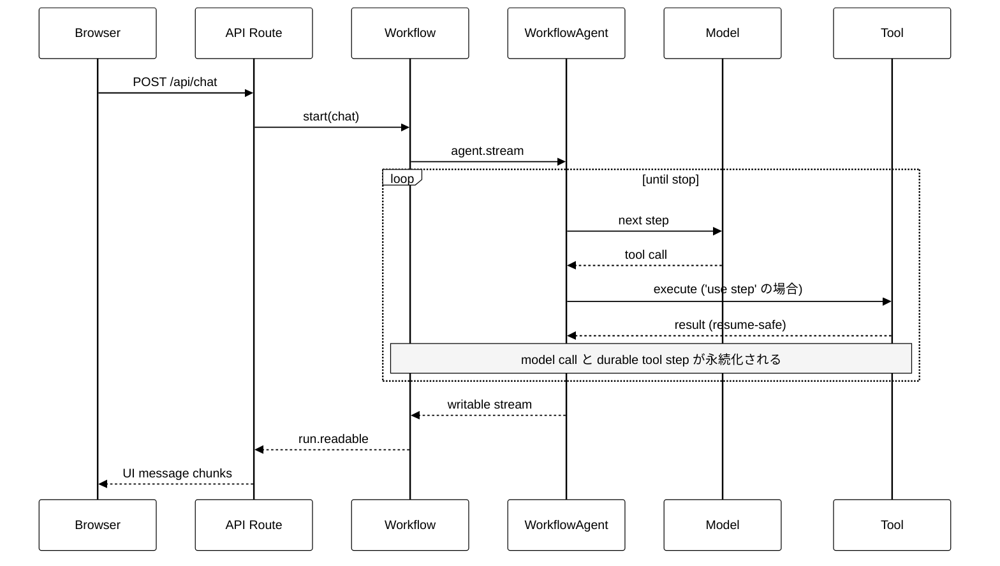

<div class="flex flex-col h-full justify-between">

<div>
  <div class="mm-folio">Vercel · AI SDK 7 stable · July 2026</div>
  <div class="mm-rule-thin mt-2"></div>
</div>

<div class="flex-1 flex flex-col justify-center">
  <div class="mm-display text-[6rem] leading-[1] italic">AI&nbsp;SDK</div>
  <div class="mm-display text-[10rem] leading-[1] italic -mt-2">v7</div>
  <div class="mm-rule-ultra mt-8 w-40"></div>
  <div class="mm-italic text-2xl mt-6 max-w-[36rem]">
    WorkflowAgent を中心に — 2026 年7月版
  </div>
</div>

<div class="flex items-end">
  <div class="mm-meta">
    2026 · 07 · TSUBOI HIROKI
  </div>
</div>

</div>

<!--
AI SDK 7 は 2026-06-25 に stable release。
2026-07-11 確認時点で npm latest は ai@7.0.22、@ai-sdk/workflow@1.0.22。
-->

---
layout: default
---

<div class="mm-folio mb-2">Contents · 目次</div>

# Table of Contents

<div class="grid grid-cols-3 gap-x-10 gap-y-5 mt-5">

<div class="border-t-2 border-black pt-3">
  <div class="mm-folio mb-1">00 · Aside</div>
  <div class="mm-italic text-xl">Versioning</div>
  <div class="text-sm opacity-70">Minor が常に 0 な理由</div>
</div>

<div class="border-t-2 border-black pt-3">
  <div class="mm-folio mb-1">01 · Chapter</div>
  <div class="mm-italic text-xl">Durability</div>
  <div class="text-sm opacity-70">なぜ Durable Agent か</div>
</div>

<div class="border-t-2 border-black pt-3">
  <div class="mm-folio mb-1">02 · Chapter</div>
  <div class="mm-italic text-xl">WorkflowAgent</div>
  <div class="text-sm opacity-70">基本実装と接続方法</div>
</div>

<div class="border-t-2 border-black pt-3">
  <div class="mm-folio mb-1">03 · Interlude</div>
  <div class="mm-italic text-xl">Directives</div>
  <div class="text-sm opacity-70">'use workflow' の系譜</div>
</div>

<div class="border-t-2 border-black pt-3">
  <div class="mm-folio mb-1">04 · Chapter</div>
  <div class="mm-italic text-xl">Catalog</div>
  <div class="text-sm opacity-70">v7 の他の新機能</div>
</div>

<div class="border-t-2 border-black pt-3">
  <div class="mm-folio mb-1">05 · Chapter</div>
  <div class="mm-italic text-xl">Weakness</div>
  <div class="text-sm opacity-70">現実的な弱点</div>
</div>

<div class="border-t-2 border-black pt-3">
  <div class="mm-folio mb-1">— · Endmatter</div>
  <div class="mm-italic text-xl">Summary</div>
  <div class="text-sm opacity-70">結語と参考文献</div>
</div>

</div>

---
layout: section
---

<div class="mm-folio opacity-70 mb-4">Aside</div>

# 00 — Versioning

---
layout: default
---

# 公式 Versioning Policy が答え

[ai-sdk.dev/v7/docs/migration-guides/versioning](https://ai-sdk.dev/v7/docs/migration-guides/versioning) に明文化されている

| 種類 | 公式ドキュメントの定義 |
|---|---|
| **Major** | Breaking API updates that require code changes |
| **Minor** | **Blog post that aggregates new features and improvements into a public release** |
| **Patch** | New features and bug fixes |

<v-click>

つまり SemVer の一般的な解釈とは違って:

- **新機能・改善は全部 Patch** に流し込む
- Minor は **「ブログを書く価値がある節目」** のときだけ上げる
- 結果として `5.0.x → 6.0.0` のように **Minor は 0 のまま**

</v-click>

<v-click>

「**新機能がない**」のではなく、Vercel が **Changesets で日次レベルにリリース**しているだけ
（2026-07-11 確認時点で `ai@7.0.22`、`@ai-sdk/workflow@1.0.22`）

</v-click>

---
layout: section
---

<div class="mm-folio opacity-70 mb-4">Chapter</div>

# 01 — Durability

---
layout: default
---

# ToolLoopAgent の限界 — 「消える」のは何か

`ToolLoopAgent` の **実行中 loop** はインメモリ。DB に保存したチャット履歴まで消えるわけではない

<v-clicks>

- DB に保存済みの `messages` / チャット履歴は **残る**
- 障害時に失うのは、未保存の step・tool result・生成途中の回答などの **in-flight state**
- 保存済み履歴から次の request を開始できるが、同じ checkpoint からの **自動再開ではない**
- tool の副作用だけ成功して記録前に落ちると、再実行による二重処理を防ぐ **冪等性** が必要
- step 単位の永続化・再試行・観測はアプリ側で設計する

</v-clicks>

<!--
ここで「プロセスが落ちると進捗がすべて消える」とは言わない。
DB に保存済みのチャット履歴や tool result は残り、次の呼び出しの context に再利用できる。

ただし、それは保存された履歴を使った「新しい agent 実行」であり、
落ちた ToolLoopAgent の内部 loop を同じ位置から resume することではない。
たとえば航空券検索が終わった後、その結果を保存する前に落ちれば検索はやり直しになる。

さらに予約 API が成功した直後、成功結果の保存前に落ちると、
外部では予約済みなのに DB では未完了に見える。再実行には idempotency key や照合処理が必要。

messages、tool call、tool result、approval、step status を都度保存し、
job queue と冪等性も実装しているなら、アプリ側ですでに durability の一部を構築している。
WorkflowAgent の差は、この step checkpoint / replay / retry を runtime の責務として提供する点。

AI Workspace の実装は経路ごとに異なる。
通常の ToolLoopAgent route は、過去履歴とユーザー発話を DynamoDB から復元し、
assistant 応答は基本的に onEnd で保存する。onStepEnd は telemetry / UI 更新が中心で、
tool call / tool result を durable step として保存してはいない。
コード上も timeout 時は onEnd が bypass され、部分応答は保存されないと明記されている。

一方、General Agent の直叩き経路はより durable に近い。
ユーザー発話の即時保存、assistant text がある HITL ゲート到達時の parts checkpoint、
abort / disconnect / error 時の部分 assistant 保存、Claude SDK transcript の S3 mirror / resume がある。
ただし pending approval の Queue はプロセスメモリ上で sticky session 前提。
また tool の副作用を tool_use_id で実行前後に台帳化する汎用 idempotency layer はない。
したがって「部分的な durability は自前実装済み。ただし Workflow step 相当の exactly-once / replay ではない」が正確。
-->

---
layout: default
---

# 例: 「航空券 + ホテル + 人間承認」エージェント

<div class="mm-folio mt-1 mb-2">Scenario · 来週東京3泊、予算15万円</div>



---
layout: default
---

# 違いは「障害後の再開」を誰が判断するか

<div class="grid grid-cols-2 gap-x-6 mt-4">

<div class="border-2 border-black p-5">
<div class="mm-folio mb-1">AI Workspace · ToolLoopAgent</div>
<div class="mm-italic text-2xl mb-3">アプリが再開を管理</div>
<ol class="text-sm leading-snug">
<li>履歴・tool result を DB に保存</li>
<li>障害後、<strong>どこまで完了したかをアプリが判断</strong></li>
<li>必要な処理を選び、agent を新しく起動</li>
</ol>
<div class="mt-3 pt-3 border-t border-black text-xs leading-snug">
DB 保存だけでは「次の処理・再開位置・retry 回数」は管理されない。
</div>
</div>

<div class="mm-invert-panel border-2 border-black p-5">
<div class="mm-folio mb-1 opacity-80">WorkflowAgent</div>
<div class="mm-italic text-2xl mb-3">runtime が再開を管理</div>
<ol class="text-sm leading-snug">
<li>各 step の input・output・status を記録</li>
<li>完了済み step は <strong>保存済み output を再利用</strong></li>
<li>未完了 step から自動再開・retry</li>
</ol>
<div class="mt-3 pt-3 border-t border-white/50 text-xs leading-snug">
会話ではなく、agent の実行そのものを step 単位で復元する。
</div>
</div>

</div>

<div class="mt-4 border-l-4 border-black pl-4 text-sm leading-snug">
<strong>障害例:</strong> 検索 ✓ → 資料作成 ✓ → メール送信中 ×<br>
AI Workspace は「メールから再開」の判定・実装が必要。WorkflowAgent は完了済み2 stepを再利用し、メール step から再開する。
</div>

<div class="mt-2 text-[10px] opacity-80">
どちらも外部 API の二重実行防止には idempotency key が必要。
</div>

<!--
AI Workspace に当てはめると、左側も単純な stateless ではない。
通常 Agent はチャット履歴を DynamoDB に保存し、General Agent はさらに
HITL ゲート・部分応答・debug parts・S3 transcript を checkpoint している。

ただし message id の固定による PutItem 上書きは「メッセージ保存の dedupe」であり、
外部 API や MCP tool の副作用に対する idempotency とは別物。
承認済み tool が成功した直後、result の永続化前に落ちるケースでは、
再開側がその成功を確実に判定できる汎用 execution ledger はまだない。
-->

---
layout: default
---

# World は AI の記憶ではない

<div class="mt-2 text-sm leading-snug">
runtime が読む <strong>Workflow 専用の実行基盤</strong>。アプリ DB とは役割が違う。
</div>

<div class="grid grid-cols-2 gap-x-6 mt-3">

<div class="border-2 border-black p-5">
<div class="mm-folio mb-1">PRODUCT STATE</div>
<div class="mm-italic text-xl mb-3">アプリ DB</div>
<ul class="text-sm leading-snug">
<li>チャット履歴・ユーザー・UI・業務データ</li>
<li>AI Workspace は tool-use / result・HITL parts も保存</li>
<li>UI と model context の復元に使う</li>
</ul>
<div class="mt-3 pt-3 border-t border-black text-xs">
<strong>目的:</strong> 会話と画面を戻す
</div>
</div>

<div class="mm-invert-panel border-2 border-black p-5">
<div class="mm-folio mb-1 opacity-80">EXECUTION STATE</div>
<div class="mm-italic text-xl mb-3">World</div>
<ul class="text-sm leading-snug">
<li><strong>Event log</strong> — step の input / output / status / attempt / error</li>
<li><strong>Queue</strong> — 未完了 step を配送・再試行</li>
<li><strong>Compute</strong> — workflow / step を実行</li>
</ul>
<div class="mt-3 pt-3 border-t border-white/50 text-xs">
<strong>目的:</strong> 正しい step から再開する
</div>
</div>

</div>

<div class="mt-4 border-l-4 border-black pl-4 text-sm leading-snug">
障害 → runtime が event log を読む → 完了済み output を replay → 未完了 step を queue へ
</div>

<div class="mt-2 text-xs leading-snug">
AI が「どこまで終わったか」を推測するのではない。<strong>runtime が機械的に判断する。</strong>
</div>

<div class="mt-2 text-[10px] opacity-80">
World: Vercel managed / Postgres / Local ｜ Durable ≠ exactly-once — 外部 API には idempotency key が必要
</div>

<!--
AI Workspace でも、General Agent は tool-use / tool-result を保存している。
chat_message_parts には MyUIMessage.parts の JSON、S3 SessionStore には Claude SDK transcript が入る。
したがって「HITL だけ保存、tool call は未保存」ではない。

ただし、これは主に表示・会話文脈を復元するための snapshot。
通常の ToolLoopAgent route では onStepEnd ごとの durable step record はなく、
General Agent でも全 tool に対する status / attempt / retry ownership の共通台帳はない。

WorkflowAgent の model call は内部で 'use step' として実行される。
tool については execute 関数を 'use step' にしたものだけが、自動 retry / persistence の対象。
World は append-only event log を中心に run / event / step / hook を管理する。

保存先は World 実装で変わる。
- Vercel World: Vercel managed storage + Vercel Queues
- Postgres World: PostgreSQL の runs / events / steps / hooks + graphile-worker
- Local World: .workflow-data/ の JSON。queue は in-memory なので開発用

WorkflowAgent の needsApproval は messages 継続。
承認状態をチャットとして再表示するには、アプリ DB への messages 保存が引き続き必要。
同じ workflow run を承認待ちで suspend したい場合は Workflow SDK Hook を使う別設計。

最後に重要な注意。
Workflow runtime が step を retry できても、外部 API の exactly-once までは自動保証しない。
外部 API 成功後、step_completed の記録前に落ちると再実行され得る。
Workflow SDK は getStepMetadata().stepId を外部 API の idempotency key に使うことを推奨している。
-->

---
layout: default
---

# コードで見る差分

```ts {all|2-3|5-6}
// AI SDK 6 — ToolLoopAgent: 承認は messages 継続
const agent = new ToolLoopAgent({
  tools: { searchFlights, searchHotels, bookFlight, bookHotel },
})
const first = await agent.generate({ prompt: '来週東京3泊、予算15万' })
// approval request を返して終了。継続には messages の保存・再送が必要
```

```ts {all|2|5|7-12|14}
// AI SDK 7 — WorkflowAgent: durable step + approval 継続
async function bookFlightStep(input) {
  'use step'
  return bookFlight(input)
}

export async function chat(messages) {
  'use workflow'
  const agent = new WorkflowAgent({
    model: 'anthropic/claude-sonnet-4-6',
    tools: {
      bookFlight: tool({ execute: bookFlightStep, needsApproval: true }),
    },
  })
  await agent.stream({ messages, writable: getWritable() })
}
// 承認応答は messages に追加して再 POST。'use step' tool は retry 可能
```

---
layout: default
---

# WorkflowAgent の位置づけ

<div class="mm-slide-lead">
<code v-pre>@ai-sdk/workflow</code> パッケージで提供される <strong>durable</strong> 版エージェント
</div>

| 観点 | ToolLoopAgent (`ai`) | WorkflowAgent (`@ai-sdk/workflow`) |
|---|---|---|
| ランタイム | loop はインメモリ<br>履歴保存はアプリ側 | Workflow runtime（World が queue / 永続化を担当） |
| 耐障害性 | 実行中 loop はインメモリ | **workflow step は再起動を跨いで生存** |
| ツール再試行 | アプリ側で設計 | **`'use step'` tool は自動** |
| Human-in-the-loop | messages で継続 | messages で継続 + **durable step** |
| `generate()` | あり | **未実装**（`throw new Error`） |
| `stream()` | あり | プライマリ API |
| 出力 | streamText の戻り値 | `writable` パラメタに `ModelCallStreamPart` |

<div class="mt-2 text-[10px] opacity-80">
World = Workflow DevKit の実行バックエンド。公式は Local（開発）/ Vercel（managed）/ Postgres（self-host）。
</div>

<!--
"durable" を翻訳すれば「永続的・耐久性のある」。
要するに ToolLoopAgent と同じループを、各ツール呼び出しが workflow ステップになる形で実行する。
-->

---
layout: default
---

# 解決したい4つの問題

公式ドキュメント [ai-sdk.dev/v7/docs/agents/workflow-agent](https://ai-sdk.dev/v7/docs/agents/workflow-agent) より

<v-clicks>

1. **Statefulness** — プロセス境界を跨いで状態を保持
2. **Resumability** — 失敗したステップから再開（最初からやり直さない）
3. **Human-in-the-loop** — 承認待ちで一時停止し、後で再開
4. **Observability** — 各ツール呼び出しが独立したワークフローステップとして可視化

</v-clicks>

---
layout: section
---

<div class="mm-folio opacity-70 mb-4">Chapter</div>

# 02 — WorkflowAgent の基本実装

Agent 本体、API ルート、再接続 Transport の3点だけ見る

---
layout: default
---

# WorkflowAgent は workflow 関数の中で動かす

```ts {all|1-4|6-8|10-17|19-22|all}
async function bookFlightStep(input) {
  'use step'
  return bookFlight(input)
}

export async function chat(messages: UIMessage[]) {
  'use workflow'
  const modelMessages = await convertToModelMessages(messages)
  const agent = new WorkflowAgent({
    model: 'anthropic/claude-sonnet-4-6',
    tools: {
      searchFlights: tool({ execute: searchFlightsStep }),
      bookFlight: tool({
        needsApproval: true,
        execute: bookFlightStep,
      }),
    },
  })
  const result = await agent.stream({
    messages: modelMessages,
    writable: getWritable<ModelCallStreamPart>(),
  })
  return { messages: result.messages }
}
```

---
layout: default
---

# API ルートは Workflow を起動するだけ

```ts {all|1-3|7|9|11-13|all}
import { createModelCallToUIChunkTransform } from '@ai-sdk/workflow'
import { createUIMessageStreamResponse, type UIMessage } from 'ai'
import { start } from 'workflow/api'
import { chat } from '@/workflow/agent-chat'

export async function POST(request: Request) {
  const { messages }: { messages: UIMessage[] } = await request.json()

  const run = await start(chat, [messages])

  return createUIMessageStreamResponse({
    stream: run.readable.pipeThrough(createModelCallToUIChunkTransform()),
    headers: { 'x-workflow-run-id': run.runId },
  })
}
```

`createModelCallToUIChunkTransform()` で生の `ModelCallStreamPart` を **UI 用チャンクに変換**

---
layout: default
---

# 実行フロー

<div class="mt-2 mb-2 border-l-4 border-black pl-4 text-sm leading-snug">
Browser の依頼 → Workflow を起動 → Agent が model / tool を反復 → 結果を stream で返す。<br>
<strong>API Route は中継だけ。永続化と再開は Workflow runtime が担当する。</strong>
</div>



---
layout: default
---

# 切れても再開する: WorkflowChatTransport

```tsx {all|1-3|6-10|12-13|all}
'use client'
import { useChat } from '@ai-sdk/react'
import { WorkflowChatTransport } from '@ai-sdk/workflow'

export default function Chat() {
  const transport = new WorkflowChatTransport({
    api: '/api/chat',
    maxConsecutiveErrors: 5,
    initialStartIndex: -50,
  })

  const { messages, sendMessage } = useChat({ transport })
  // ストリームが finish イベントなしで切れたら自動再接続して "続きから" 再開
  return (/* ... */)
}
```

<div class="mt-2 text-[11px] border-t-2 border-black pt-2">
  <code>x-workflow-run-id</code> + <code>GET /api/chat/{runId}/stream</code> は <strong>切断 stream の同一 run 再接続</strong>。approval は messages へ応答を追加して再 POST する別フロー。
</div>

<!--
通常の useChat の transport を WorkflowChatTransport に差し替えた上で、サーバー側に reconnect endpoint を生やす。
サーバー側で何分かかっても、長時間ストリームが途切れても自動復旧する。
-->

---
layout: default
---

# AI SDK 7 stable release highlights

2026-06-25 の公式 blog で **AI SDK 7 stable** として発表

<v-clicks>

- **Develop** — `reasoning`、typed tool / runtime context、provider file / skill uploads、MCP Apps、TUI
- **Run** — tool approvals、`WorkflowAgent`、timeouts、sandbox support
- **Integrate** — Codex / Claude Code / Deep Agents / OpenCode / Pi など任意の agent harness
- **Observe** — telemetry、Node.js tracing channel、lifecycle events、performance statistics
- **Beyond text** — provider-agnostic realtime voice、experimental video generation

</v-clicks>

<v-click>

WorkflowAgent は「Run agents」の中核。beta 時代の細かい差分より、  
**production agent stack の一部として stable 化した**ことが今回の大きな変化

</v-click>

---
layout: default
---

# Stable 後の更新 — 7.0.22

<div class="mm-folio mt-1 mb-3">2026-07-11 確認 · ai@7.0.22 / @ai-sdk/workflow@1.0.22</div>

<v-clicks>

- **Resumable stream の hardening** — orphan chunk 修復、step payload 削減、`finishReason` / `totalUsage` 追加
- **MCP security** — `fingerprintTools` / `detectToolDrift` で tool definition の rug pull を検知
- **Approval security** — 署名 metadata 保持、prototype-property collision 対策
- **API の安定化** — `repairToolCall` が stable、MCP tool call に `maxRetries`
- **Beyond text の拡張** — streaming transcription、video reference input、Cartesia provider

</v-clicks>

<div class="mt-5 border-t-2 border-black pt-3 text-base">
stable 後の主戦場は、<strong>新しい agent API の追加だけでなく、再接続・承認・MCP の安全性と運用性</strong>。
</div>

<div class="mt-2 text-xs opacity-70">
Source: <a href="https://github.com/vercel/ai/blob/main/packages/ai/CHANGELOG.md">ai CHANGELOG</a> / <a href="https://github.com/vercel/ai/blob/main/packages/workflow/CHANGELOG.md">@ai-sdk/workflow CHANGELOG</a>
</div>

---
layout: default
---

# MCP Apps: 2つの sandbox

<div class="mm-slide-lead">
MCP Apps は tool result に紐づく <code>ui://</code> HTML resource を、<code>experimental_MCPAppRenderer</code> が sandboxed iframe に描画する仕組み
</div>

| レイヤー | 何を隔離するか | AI SDK 7 での見方 |
|---|---|---|
| **MCP Apps / iframe** | `ui://` HTML resource を browser の sandboxed iframe に閉じ込める | `modelVisible` tools だけを LLM に渡し、`appVisible` tools は UI 側に残す |
| **Host API** | iframe からの要求を server 側で検査する | `readMCPAppResource` で HTML / CSP / permissions を読み、`callTool` は allowlist / auth / approval を通す |
| **Vercel Sandbox** | Firecracker microVM で未信頼コードを実行する | MCP Apps の表示 sandbox ではない。Code Mode 風の `execute(code)` や preview server の実行基盤にできる |

<div class="mt-4 border-t-2 border-black pt-3 text-base">
つまり: <strong>モデルに見せる能力</strong> と <strong>ユーザーが操作する UI</strong> と <strong>未信頼コード実行</strong> を別々に設計できる。
</div>

<div class="mt-2 text-sm opacity-70">
Docs: <a href="https://vercel.com/kb/guide/ai-sdk-mcp-apps">AI SDK MCP Apps guide</a> / <a href="https://vercel.com/docs/sandbox">Vercel Sandbox</a> / <a href="https://blog.cloudflare.com/ja-jp/code-mode-mcp/">Cloudflare Code Mode</a>
</div>

---
layout: section
---

<div class="mm-folio opacity-70 mb-4">Interlude</div>

# 03 — Directives

<div class="mt-6 text-xl italic opacity-90 max-w-[40rem]">
  `'use workflow'` は Next.js 専用機能ではなく、React 起源のディレクティブパターンが膨らんだもの
</div>

---
layout: default
---

# 'use workflow' は突然変異ではない

ディレクティブの系譜を追うと、**ECMAScript → React → Next.js → Vercel** と層を超えて増殖してきた

| ディレクティブ | 出自 | 役割 |
|---|---|---|
| `"use strict"` | ECMAScript 5 (2009) | 厳格モード（**唯一の標準化済み**） |
| `"use asm"` | asm.js (2013, Mozilla) | パフォーマンスヒント。WASM に置き換えられ消滅 |
| `"use client"` | React Server Components (2023) | Client Component 境界 |
| `"use server"` | React Server Components (2023) | Server Action / Function 境界 |
| `"use memo"` / `"use no memo"` | React Compiler (2024) | コンパイル対象制御（escape hatch） |
| `"use cache"` | Next.js 15 / Cache Components (2024) | キャッシュ境界 |
| `"use workflow"` / `"use step"` | Vercel Workflow SDK (2025) | 永続実行境界 |

<v-click>

最初は ECMAScript 標準だったのに、**フレームワーク・ランタイムが各々増やしている**現状

</v-click>

---
layout: default
---

# なぜディレクティブなのか

技術的には合理的な選択

<v-clicks>

- **静的解析可能** — コンパイル時にバンドラ/コンパイラが拾える
- **runtime inert** — 実行時はただの文字列、評価されない
- **minify を生き残る** — コンパイラが保持する
- **関数シグネチャを変えない** — decorator より構文的に軽量
- **モジュール境界を明示** — import/export より宣言的

</v-clicks>

<v-click>

ただし React Compiler の **公式定義** ([react.dev](https://react.dev/reference/react-compiler/directives)) は控えめ:

> Directives are escape hatches.  
> Prefer configuring the compiler at the project level.

つまり React 自身は **「控えめに使うべき」** と言っているが、エコシステムは逆方向に走っている

</v-click>

---
layout: default
---

# WorkflowAgent と 'use workflow' の本質

`WorkflowAgent` は **ライブラリコードだけでは durable にならない**

```ts {all|2|4-5|all}
export async function chat(messages: UIMessage[]) {
  'use workflow'                    // ← これが無いと普通の関数

  const agent = new WorkflowAgent({ /* ... */ })
  const result = await agent.stream({ /* ... */ })
  return { messages: result.messages }
}
```

<v-clicks>

- `'use workflow'` ディレクティブが **コンパイラ/ランタイムに「この関数を Workflow ステップ化せよ」** と指示
- 関数本体は **state machine 相当のコードに変換**される（クラッシュからの再開のため）
- WorkflowAgent は **その変換が起きていることを前提に動作**
- → ライブラリ・runtime・directive が **3 点セットで結合**

</v-clicks>

---
layout: default
---

# ニュアンス — Workflow SDK は実は portable

<div class="grid grid-cols-2 gap-8 mt-5 text-sm leading-snug">

<div class="border-t-2 border-black pt-3">
<div class="mm-folio mb-2">Backend</div>
<ul>
<li><strong>Worlds</strong> という pluggable backend 抽象化</li>
<li>公式: <strong>Local / Vercel / Postgres</strong></li>
<li>Postgres World は Docker / Kubernetes / VM / 任意 cloud で self-host</li>
<li>その他は community / custom World</li>
</ul>
</div>

<div class="border-t-2 border-black pt-3">
<div class="mm-folio mb-2">Lock-in</div>
<ul>
<li>✅ backend は Worlds で差し替え可能</li>
<li>⚠️ directive / deterministic replay 仕様への依存は残る</li>
<li>⚠️ managed は Vercel、self-host は Postgres が中心</li>
<li>⚠️ 非 Vercel World は利用環境で E2E 検証</li>
</ul>
</div>

</div>

<div class="mt-6 border-2 border-black p-4 text-base">
結論: <strong>Vercel 完全ロックインではないが、Workflow SDK の実行モデルにはロックインする。</strong>
</div>

---
layout: default
---

# 採用するときの実践的指針

<v-clicks>

1. **境界を明示** — どのファイルが durable で、どれが純粋関数なのか
2. **抽象化レイヤーを噛ませる** — `'use workflow'` を持つファイルを「境界モジュール」として隔離
3. **テスト戦略を分ける** — directive は単体テストでは効かない、E2E が必要
4. **チーム内リファレンス** — 各 directive が何者なのか文書化
5. **ロックインの方向を意識** — 何にロックインしているかを把握（Vercel? Workflow SDK? React?）

</v-clicks>

<v-click>

> ディレクティブは便利。でも **「JS 標準ではない」** という事実は常に頭に置く

</v-click>

---
layout: default
---

<div class="mm-folio mb-2">Recommendation · AI Workspace</div>

# 全部は変えない。必要な Agent だけ durable にする

<div class="mt-2 text-lg leading-snug">
結論は <strong>WorkflowAgent の部分導入</strong>。全面置換ではない。
</div>

<div class="grid grid-cols-[1.35fr_0.9fr] gap-x-8 mt-5">

<div>
<div class="mm-folio mb-2">導入する順番</div>

<div class="border-t-2 border-black py-3 grid grid-cols-[2.3rem_1fr] gap-x-3">
<div class="mm-italic text-3xl">1</div>
<div>
<div class="text-base font-bold">RAG / Knowledge で障害テスト</div>
<div class="text-sm">読み取り中心の Agent で、完了済み検索を再利用できるか検証</div>
</div>
</div>

<div class="border-t border-black py-3 grid grid-cols-[2.3rem_1fr] gap-x-3">
<div class="mm-italic text-3xl">2</div>
<div>
<div class="text-base font-bold">書き込み tool に冪等性を入れる</div>
<div class="text-sm">WorkflowAgent でも外部 API の exactly-once は保証されない</div>
</div>
</div>

<div class="border-y border-black py-3 grid grid-cols-[2.3rem_1fr] gap-x-3">
<div class="mm-italic text-3xl">3</div>
<div>
<div class="text-base font-bold">Holiday / User Admin へ広げる</div>
<div class="text-sm">長時間・複数 tool・承認ありほど durable 化の効果が大きい</div>
</div>
</div>
</div>

<div class="border-l-2 border-black pl-5">
<div class="mm-folio mb-3">変えない範囲</div>
<div class="mm-italic text-xl mb-1">短い Q&amp;A</div>
<div class="text-sm mb-5">失敗時に最初からやり直せる処理は ToolLoopAgent のまま</div>

<div class="mm-italic text-xl mb-1">General / MI Agent</div>
<div class="text-sm">Claude Agent SDK + AgentCore の別基盤。置換ではなく再設計になる</div>
</div>

</div>

<div class="mt-5 mm-invert-panel border-2 border-black px-5 py-3 text-sm leading-snug">
<strong>最初の判断ゲート:</strong> Vercel World は現在 <code v-pre>iad1</code>。社内データの保存先要件を確認し、不可なら AWS 東京の Postgres / custom World を検討する。
</div>

<!--
通常 Agent route は maxDuration=800s、agent.stream は totalMs=740s。
timeout では onEnd がバイパスされ、部分応答は保存されないと実装コメントにも明記されている。
この「1 request 内で loop 全体を完走させる」制約は WorkflowAgent と相性がよい改善対象。

ただし dynamic MCP client、DB client、SDK client は workflow 境界を越えて保持できない。
識別子・設定だけを serializable context として渡し、各 step 内で再接続する。

書き込み tool は、外部 API 成功後・step 完了記録前に落ちると retry され得る。
runId / stepId / toolCallId などから安定した idempotency key を作る。

General / MI Agent は通常 route を通らず、ブラウザから AgentCore Runtime を直接 invoke する。
HITL queue と reconnect の耐障害化は重要だが、WorkflowAgent 置換とは別トラックで扱う。

検証では「検索完了直後に process kill → 検索を再実行せず次 step から再開」を合格条件にする。

Sources:
https://vercel.com/kb/guide/what-is-workflowagent
https://workflow-sdk.dev/worlds/vercel
https://workflow-sdk.dev/worlds/postgres
https://github.com/mhigroup/A0005-AI-Workspace/blob/develop/frontend/app/api/chat/histories/%5BhistoryId%5D/agent/route.ts
https://github.com/mhigroup/A0005-AI-Workspace/blob/develop/frontend/app/api/chat/histories/%5BhistoryId%5D/agent/agentRegistry.ts
-->

---
layout: section
---

<div class="mm-folio opacity-70 mb-4">Chapter</div>

# 04 — Catalog

<div class="mt-6 text-xl italic opacity-90 max-w-[40rem]">
  WorkflowAgent 以外にも Agent 周りが大幅に進化
</div>

---
layout: default
---

# Subagents — 公式パターン化

親エージェントが **tool の `execute` から子Agentを呼ぶ** パターンを公式ドキュメント化

<div class="text-xs opacity-80 mt-1">
Docs: <a href="https://ai-sdk.dev/v7/docs/agents/subagents">ai-sdk.dev/v7/docs/agents/subagents</a>
</div>

<v-clicks>

- 子は **独立した context window** を持つ → 探索ログを親に抱えさせない
- `toModelOutput` で **親が見る要約だけを返せる**（総tokenは減らず、親contextを守る）
- 並列リサーチ / Tool 権限分離を自然に書ける

</v-clicks>

<v-click>

```ts {all|4-7|9}
const research = tool({
  inputSchema: z.object({ topic: z.string() }),
  execute: async ({ topic }, { abortSignal }) => {
    const r = await new ToolLoopAgent({
      model,
      tools: { searchWeb, readUrl },
    }).generate({ prompt: topic, abortSignal })
    return r.text
  },
  toModelOutput: ({ output }) => ({
    type: 'text',
    value: output.slice(0, 1000),
  }),
})
```

</v-click>

---
layout: default
---

# 型付き Context: 何が嬉しい？

ツールが必要なサーバー側の値を **schema として宣言** できる

<div class="grid grid-cols-2 gap-5 mt-4">

<div>
<div class="mm-folio mb-2">Before · 旧実装</div>

```ts
const apiKey = process.env.WEATHER_API_KEY!
const weather = tool({
  inputSchema: z.object({ location: z.string() }),
  execute: async ({ location }) =>
    getWeather(location, apiKey),
})
```

- 外側の値に暗黙依存
- tool単体で必要な値が読めない
- テストや差し替えで壊れやすい
</div>

<div>
<div class="mm-folio mb-2">After · AI SDK 7</div>

```ts
const weather = tool({
  inputSchema: z.object({ location: z.string() }),
  contextSchema: z.object({ apiKey: z.string() }),
  execute: async ({ location }, { context }) =>
    getWeather(location, context.apiKey),
})

await agent.generate({
  prompt,
  toolsContext: {
    weather: { apiKey: process.env.WEATHER_API_KEY! },
  },
})
```
</div>

</div>

<v-click>

<div class="mt-3 text-sm opacity-90">
嬉しさ: `execute` の `context` に型推論が効く。ツールごとに必要な権限・API key を分離でき、WorkflowAgent では <strong>serializable な値</strong> として step 境界を越えやすい。
</div>

</v-click>

---
layout: default
---

# ツール承認 API の刷新

`generateText` / `streamText` / `ToolLoopAgent` は  
`tool({ needsApproval })` → **呼び出し側の `toolApproval`** に移動

```ts {all|2-7|10-16}
// AI SDK 6 — 承認ロジックがツール定義に固定されていた
const deleteFile = tool({
  inputSchema: z.object({ path: z.string() }),
  needsApproval: async ({ path }) => !path.startsWith('/tmp/'),
  execute: async ({ path }) => removeFile(path),
})

// AI SDK 7 — 呼び出し側で承認ポリシーを決める
await streamText({
  model,
  tools: { deleteFile },
  toolApproval: {
    deleteFile: async ({ path }) =>
      path.startsWith('/tmp/') ? undefined : 'user-approval',
  },
})
```

<div class="mt-3 text-sm opacity-85">
  承認ポリシーを <strong>リクエスト単位</strong> で差し替えられる。例外として <code v-pre>WorkflowAgent</code> は workflow-aware な approval フローのため、最新 docs でも tool 定義の <code v-pre>needsApproval</code> を使う
</div>

---
layout: default
---

# Agent の動的設定: callOptionsSchema + prepareCall

エージェントに **「ランタイム入力のスキーマ」** を持たせる

```ts {all|3-6|7-10|14-17}
const supportAgent = new ToolLoopAgent({
  model,
  callOptionsSchema: z.object({
    userId: z.string(),
    accountType: z.enum(['free', 'pro', 'enterprise']),
  }),
  prepareCall: ({ options, ...settings }) => ({
    ...settings,
    instructions: `${settings.instructions}\nAccount: ${options.accountType}`,
  }),
})

await supportAgent.generate({
  prompt: 'How do I upgrade?',
  options: { userId: 'u_123', accountType: 'pro' },
})
```

モデル選択・instructions・tools を **リクエスト単位で型安全に** 切り替えられる

---
layout: default
---

# Memory — 3 つの使い分け

<div class="text-xs opacity-80 -mt-2 mb-4">
Docs: <a href="https://ai-sdk.dev/v7/docs/agents/memory">ai-sdk.dev/v7/docs/agents/memory</a>
</div>

| アプローチ | 何を任せる？ | 選ぶとき |
|---|---|---|
| **Provider-defined tools**<br/>例: Anthropic Memory Tool | モデルに memory 操作の判断を任せる。自分は保存先を実装 | Claude 前提で、最小実装にしたい |
| **Memory providers**<br/>例: Letta / Mem0 | 外部 provider に抽出・検索・注入を任せる | 既製の長期記憶基盤や管理画面を使いたい |
| **Custom tool** | schema、検索、保存、権限、監査を自前で持つ | DB/RAG/権限制御を完全に握りたい |

<div class="mt-4 border-2 border-black p-4 text-sm leading-snug">
<strong>Anthropic Memory Tool の嬉しさ:</strong>
Claude が知っている `/memories` IF（`view/create/replace` 等）を使える。
独自 memory tool の schema 設計をかなり省ける一方、Claude 専用の provider lock-in は受け入れる。
</div>

---
layout: default
---

# Telemetry の正式化

<v-clicks>

- `experimental_telemetry` → **`telemetry`**（stable 化、リネーム）
- OpenTelemetry が **`@ai-sdk/otel`** に分離
- `registerTelemetry(new OpenTelemetry())` をアプリ起動時に**一度だけ**
- 登録済みなら **デフォルト on**（オプトアウト方式に変わった）
- `tracer` プロパティは削除 → `OpenTelemetry` コンストラクタへ

</v-clicks>

<v-click>

```ts {all|1-2|4|6-12}
import { registerTelemetry } from 'ai'
import { OpenTelemetry } from '@ai-sdk/otel'

registerTelemetry(new OpenTelemetry())  // instrumentation.ts で一回だけ

const result = await generateText({
  model, prompt: 'Hello',
  telemetry: {                           // experimental_ プレフィックス不要
    functionId: 'story-agent',
  },
})
```

</v-click>

---
layout: default
---

# その他の整理（ざっくり）

<div class="grid grid-cols-2 gap-8 mt-5 text-sm leading-snug">
<ul>
<li><strong>ESM only</strong> — <code>require()</code> 廃止、ESM <code>import</code> へ</li>
<li><strong>Node.js 22+</strong> — 18 / 20 はサポート外</li>
<li><strong>画像・音声 stable</strong> — <code>generateImage</code> / <code>generateSpeech</code> / <code>transcribe</code></li>
<li><strong>Realtime API</strong> — OpenAI / Google / xAI を experimental 提供</li>
<li><strong>lifecycle</strong> — <code>onFinish</code> → <code>onEnd</code>、<code>onStepFinish</code> → <code>onStepEnd</code></li>
<li><strong>reasoning</strong> — provider 横断のトップレベル option</li>
</ul>
<ul>
<li><strong>message part</strong> — image を canonical <code>file</code> part に統合</li>
<li><strong>reasoning-file</strong> — 推論中の参照 file 用 type</li>
<li><strong>System message</strong> — messages 内の system role をデフォルト拒否</li>
<li><strong>MCP redirect</strong> — <code>'follow'</code> → <code>'error'</code>（SSRF 対策）</li>
<li><strong>stop condition</strong> — <code>stepCountIs</code> → <code>isStepCount</code></li>
<li><strong>package.json</strong> — <code>type: "module"</code> の要否は runtime / bundler 次第</li>
</ul>
</div>

---
layout: default
---

# Provider 側の v7 変更

<v-click>

**Anthropic**

- `providerMetadata.anthropic.cacheCreationInputTokens` 削除
- → 標準 `usage.inputTokenDetails.cacheWriteTokens` / `cacheReadTokens` に統合
- 生の Anthropic ペイロードは `providerMetadata.anthropic.usage` に残る

</v-click>

<v-click>

**Google**

- `GoogleGenerativeAI*` → `Google*` に **affix を削除**
- 例: `createGoogleGenerativeAI` → `createGoogle`、`GoogleGenerativeAIProvider` → `GoogleProvider`
- 旧名はエイリアスとして残るが、移行推奨
- `google` 定数自体は変更なし

</v-click>

---
layout: section
---

<div class="mm-folio opacity-70 mb-4">Chapter</div>

# 05 — Weakness

<div class="mt-6 text-xl italic opacity-90 max-w-[40rem]">
  調査した結果、コメントの主張と実装に乖離があった
</div>

---
layout: default
---

# ファクトチェック結果

外部レビューで主張されていた点を、ソースで一次確認した結果

| 主張 | 実態 |
|---|---|
| WorkflowAgent に **Subagent 第一級 API** が入った | ❌ CHANGELOG / docs / ソースで**裏付けなし**。専用 API は存在しない |
| **`toolsContext` のサポート**が WorkflowAgent に入っている | ✅ v7 stable docs で対応済み。ただし workflow 境界を跨ぐため **serializable 前提** |
| **`generate()` が無いのは本物のギャップ** | ✅ ソースで `throw new Error('Not implemented')` を確認 |
| **Vercel Workflow への完全ロックイン** | △ **Worlds** で backend は差し替え可能。公式は Local / Vercel / Postgres。directive / replay 仕様への依存は残る |

<!--
LLM が生成した「最新動向」をそのまま信じない。
必ず一次情報（ソースとCHANGELOG）で裏取りする習慣が大事。
-->

---
layout: default
---

# 現実的なギャップ（優先度順）

| 課題 | 深刻度 | 影響 |
|---|---|---|
| Workflow SDK の directive 仕様への暗黙の依存 | ★★★ | Worlds 抽象化で backend は差替え可能だが、directive そのものへの依存は残る |
| `stream()` のみで `generate()` が無い | ★★★★ | シンプルな同期処理が書きにくい |
| Subagent の専用 durable 統合が無い | ★★★ | tool から子 Agent を呼ぶ公式パターンはあるが、親子の durable 設計は自前 |
| context は serializable 前提 | ★★★ | DB client / SDK client など live object は step 内で再生成が必要 |
| WorkflowAgent だけ承認 API が `needsApproval` | ★★ | 他 API の `toolApproval` と覚え分けが必要 |
| workflow run と外部 APM の紐付け | ★★ | AI SDK 側 telemetry は強化。Workflow の runId / step / tool trace の設計は別途必要 |

---
layout: default
---

# Stable 後に欲しい改善

<v-clicks>

1. **`generate()` の提供** — `stream()` をラップして最後の結果だけ返せば実装可能なはず
2. **Subagents の第一級サポート** — `createSubagent()` のような API で「親 durable・子も durable」を自然に書きたい
3. **AI SDK レベルでの "World" 公式サポート** — Workflow SDK 側に Worlds は既にあるので、AI SDK のドキュメントでも非 Vercel World の例を提示してほしい
4. **WorkflowAgent の observability recipe** — `runId` / step / tool / model call を外部 APM と紐付ける定石
5. **承認継続と stream 再接続の整理** — messages 再 POST と同一 run reconnect の違いをより明確に
6. **非 serializable resource の定石** — context ではなく step 内再接続、という公式パターン

</v-clicks>

<v-click>

> 理想形: **「ToolLoopAgent と同じ API で書けるが、必要に応じて耐障害性をオンにできる」**  
> そして **Vercel 以外でも動く** 選択肢がある

</v-click>

---
layout: default
---

<div class="mm-folio mb-2">Summary · 結語</div>

# Takeaways

<div class="grid grid-cols-3 gap-x-10 gap-y-4 mt-5">

<div>
<div class="mm-folio mb-1">01</div>
<div class="mm-italic text-xl">Versioning</div>
<div class="text-sm">Minor は「ブログを書く節目」専用。開発自体は Patch でアクティブ</div>
</div>

<div>
<div class="mm-folio mb-1">02</div>
<div class="mm-italic text-xl">WorkflowAgent</div>
<div class="text-sm">model call と 'use step' tool を durable 化。承認継続は messages ベース</div>
</div>

<div>
<div class="mm-folio mb-1">03</div>
<div class="mm-italic text-xl">Directives</div>
<div class="text-sm">directive / replay 仕様に依存。backend は Worlds で差し替え可能</div>
</div>

<div>
<div class="mm-folio mb-1">04</div>
<div class="mm-italic text-xl">v7 Catalog</div>
<div class="text-sm">reasoning / context / approvals / WorkflowAgent / Memory / MCP Apps / uploads / observability</div>
</div>

<div>
<div class="mm-folio mb-1">05</div>
<div class="mm-italic text-xl">Discipline</div>
<div class="text-sm">LLM の「最新動向」要約は必ず一次情報で裏取りする — 自分の主張も含めて</div>
</div>

</div>

---
layout: default
---

<div class="mm-folio mb-2">References · 参考文献</div>

# Bibliography

<div class="grid grid-cols-2 gap-x-12 mt-4">

<div>
<div class="mm-folio mb-1 text-[10px]">AI SDK</div>

- [AI SDK 7 Blog](https://vercel.com/blog/ai-sdk-7)
- [AI SDK Versioning Policy](https://ai-sdk.dev/v7/docs/migration-guides/versioning)
- [WorkflowAgent ガイド](https://ai-sdk.dev/v7/docs/agents/workflow-agent)
- [v7 Migration Guide](https://ai-sdk.dev/v7/docs/migration-guides/migration-guide-7-0)
- [Subagents](https://ai-sdk.dev/v7/docs/agents/subagents)
- [Memory](https://ai-sdk.dev/v7/docs/agents/memory)
- [Loop Control](https://ai-sdk.dev/v7/docs/agents/loop-control)
- [Call Options](https://ai-sdk.dev/v7/docs/agents/configuring-call-options)
- [vercel/ai](https://github.com/vercel/ai)
- [`@ai-sdk/workflow` CHANGELOG](https://github.com/vercel/ai/blob/main/packages/workflow/CHANGELOG.md)

</div>

<div>
<div class="mm-folio mb-1 text-[10px]">Directives & Workflow</div>

- [React Compiler Directives](https://react.dev/reference/react-compiler/directives)
- [Workflow SDK (workflow-sdk.dev)](https://workflow-sdk.dev)
- [vercel/workflow (GitHub)](https://github.com/vercel/workflow)
- [Workflow SDK Worlds](https://workflow-sdk.dev/worlds)
- [Postgres World — 公式 self-host backend](https://workflow-sdk.dev/worlds/postgres)
- [Workflow SDK Idempotency](https://workflow-sdk.dev/docs/foundations/idempotency)

</div>

</div>

---
layout: end
---

<div class="flex flex-col items-center justify-center h-full">
  <div class="mm-folio opacity-70 mb-8">End · 終</div>
  <div class="mm-display text-[14rem] leading-none italic">Fin.</div>
  <div class="mm-rule-ultra mt-8 w-32" style="border-color: #ffffff; border-top-width: 8px;"></div>
  <div class="mm-folio mt-8 opacity-70">Q&amp;A</div>
</div>
